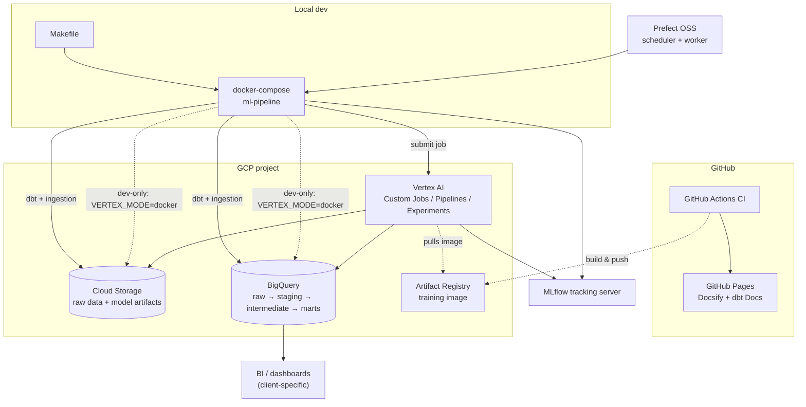
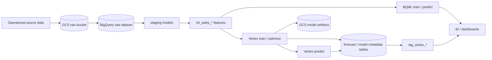

# GCP Demand Forecasting Platform

A production-style GCP demand forecasting platform built around dbt, BigQuery ML, Vertex AI, MLflow, Prefect, and Terraform.

The platform is intentionally **GCP-first**. It provides reusable infrastructure, orchestration, model execution, experiment tracking, evaluation, metadata, and documentation patterns. Each project supplies its own dbt models for the business-specific source data, grains, features, and demand semantics.

**Consulting package** — reference architecture, accelerators, and delivery artifacts for client engagements: **[docs/consulting_package.md](docs/consulting_package.md)** (rendered in hosted dbt Docs via `make dbt-ui`).

**New user?** Follow [Generate your first forecast](docs/first_forecast.md) for the supported path
from environment validation through canonical forecast output in BigQuery.

## Features

- **dbt + BigQuery ML**: Train and deploy ML models directly in BigQuery
- **Vertex AI**: Config-driven train / predict / optimize (XGBoost, Random Forest, ARIMA, SARIMA, Prophet), runnable in local Docker or as Vertex Custom Jobs
- **End-to-end Pipeline**: From data transformation to model training and prediction
- **Dockerized**: Run everything locally in Docker containers
- **Prefect**: OSS workflow orchestration for scheduled and manual dbt / Vertex / ML pipeline runs via Docker (`make prefect-*`; see [orchestration/README.md](orchestration/README.md))
- **Experiment tracking**: MLflow + Vertex AI Experiments on every Vertex job; GCS remains canonical for model files with MLflow catalog pointers on train (`make mlflow-ui`; see [Local UIs](#local-uis-mlflow--prefect))
- **pip + Docker**: Locked dependencies in `requirements.txt`; all local commands run in Docker
- **Testing**: pytest for Vertex utilities; dbt data tests on staging and intermediate models
- **CI/CD**: GitHub Actions on every push and PR (Python lint/tests, `dbt parse` / `dbt compile` / `dbt docs generate`)
- **Hosted documentation**: Docsify portal and dbt Docs deploy together to GitHub Pages on pushes to `main` / `master` (see [Hosted documentation](#hosted-documentation))
- **dbt Docs & lineage**: Project overview ([`docs/overview.md`](docs/overview.md)), exposures for ML and operational consumers (`dbt/models/exposures.yml`)
- **Code Quality**: Black, flake8, and mypy for code quality
- **Consulting package**: Architecture diagrams, accelerators inventory, case study, benchmarks, rollout playbook, and IaC guidance ([docs/consulting_package.md](docs/consulting_package.md))

## Platform scope

This repository is meant to be reused across demand forecasting projects that run on Google Cloud. Reuse comes from stable contracts and operating patterns, not from assuming every project has the same raw data model.

| Platform-owned | Project-owned |
|----------------|---------------|
| GCP deployment pattern: BigQuery, GCS, Vertex AI, Artifact Registry, Terraform | Raw source ingestion and business-specific source models |
| dbt conventions for staging, features, marts, tests, docs, and exposures | dbt models that encode the client's products, locations, calendar, prices, promotions, inventory, and target definition |
| Vertex model registry, train / predict / optimize entrypoints, model metadata, and artifacts | Forecast contracts, feature sets, grains, horizons, hierarchy, and model configuration for the use case |
| MLflow / Vertex experiment tracking and BigQuery audit tables | Business metric choices, promotion gates, and planner review policy |
| Prefect orchestration and production scheduling patterns | Deployment cadence and downstream consumption requirements |

The dbt layer is therefore a **canonical adapter layer**: each implementation maps its raw operational data into the forecast-ready models and contracts the platform expects. That adapter work is intentional and project-specific because demand forecasting features vary by industry, planning process, and available covariates.

Formal third-party plugin or connector interfaces are out of scope for now. New projects should adapt the dbt layer and configuration directly, using the specs in [docs/specs](docs/specs/README.md) as implementation guides.

## Consulting package

Productized engagement docs for proposals, kickoff, and handoff. Start at **[docs/consulting_package.md](docs/consulting_package.md)**.

| Layer | Documents |
|-------|-----------|
| **Reference architecture** | [reference_architecture.md](docs/reference_architecture.md) — GCP layers, data flows, dual ML path |
| **Accelerators** | [accelerators.md](docs/accelerators.md) — dbt, Vertex, MLflow, Prefect, platform assets |
| **Delivery artifacts** | [delivery_artifacts.md](docs/delivery_artifacts.md) — index of collateral below |

| Artifact | Document |
|----------|----------|
| Case study | [docs/case_study.md](docs/case_study.md) |
| Benchmarks | [docs/benchmarks.md](docs/benchmarks.md) |
| Client rollout (4-week) | [docs/client_rollout.md](docs/client_rollout.md) |
| IaC & GCP ops | [docs/iac.md](docs/iac.md), [vertex/ops/README.md](vertex/ops/README.md) |

Product-specific views: [dbt](docs/dbt/consulting_package.md) · [Vertex AI](docs/vertex/consulting_package.md) · [MLflow](docs/mlflow/consulting_package.md) · [Prefect](docs/prefect/consulting_package.md)

Browse locally with **`make dbt-ui`** (http://127.0.0.1:8080) or on GitHub after `dbt docs generate` in CI.

## Architecture

### System diagram



`ml-pipeline` always talks to BigQuery/GCS directly for dbt and raw ingestion — that's not ML compute and has no Vertex equivalent. For **training / predict / optimize**, the direct-write arrows (dashed) are a **local-dev-only** path (`VERTEX_MODE=docker`, used by the manual Prefect deployments and `make vertex-train` etc.) for fast, free iteration. **Scheduled** deployments in `prefect.yaml` always use `VERTEX_MODE=vertex`, so production/scheduled ML compute only ever reaches BigQuery/GCS through Vertex AI Custom Jobs / PipelineJobs — the container just submits the job.

### Data flow diagram



More detail (dual ML path, operational sequence, security/environments, CI/CD): [docs/reference_architecture.md](docs/reference_architecture.md).

## Project Structure

```
.
├── docs/                   # Project + consulting docs (dbt docs-paths: ../docs)
│   ├── overview.md        # dbt Docs Overview tab
│   ├── consulting_package.md
│   ├── dbt/               # dbt-focused consulting view
│   ├── vertex/            # Vertex-focused consulting view
│   ├── mlflow/            # MLflow-focused consulting view
│   └── prefect/           # Prefect-focused consulting view
├── dbt/                    # dbt models and configurations
│   ├── models/
│   │   ├── staging/       # Staging models
│   │   ├── intermediate/  # ML training feature sets (int_sales_*)
│   │   ├── marts/         # Final models and BQML outputs
│   │   │   └── ml_models/ # BigQuery ML models
│   │   └── exposures.yml  # Downstream ML/dashboard lineage nodes
│   ├── macros/            # dbt macros for BigQuery ML
│   └── profiles/          # dbt profiles configuration
├── vertex/                # Vertex AI custom ML (see vertex/README.md)
│   ├── config/            # model_config.yaml + loader
│   ├── jobs/              # run.py (execute) and submit.py (Custom Jobs)
│   ├── models/            # xgboost/, sklearn/, timeseries/ + registry
│   ├── utils/             # BigQuery, GCS artifacts, predictions schema
│   ├── ddl/               # BigQuery table DDL for Vertex outputs
│   └── tests/             # pytest unit tests
├── orchestration/         # Prefect flows, tasks (see orchestration/README.md)
├── prefect.yaml           # Prefect deployment definitions
├── .github/workflows/     # CI and GitHub Pages (dbt docs)
├── Dockerfile             # Docker image definition
├── docker-compose.yml     # Docker Compose configuration
├── requirements.txt       # Locked Python dependencies (pip)
├── pyproject.toml         # Tool config (black, pytest, mypy)
└── Makefile               # Convenient commands

```

## Prerequisites

- Docker and Docker Compose
- Google Cloud Platform account with:
  - BigQuery raw and analytics datasets
  - Vertex AI API enabled
  - Service account with appropriate permissions
  - GCS buckets: raw competition data (`.csv.7z`) and, for Vertex, model artifacts / staging (see `env.example`)
  - Vertex AI API enabled (if submitting Custom Jobs to GCP)

## Setup

For a new GCP environment—or an existing environment Terraform must adopt—start with the
**[guided GCP and GitHub bootstrap](docs/gcp_bootstrap.md)**. It covers cloning, local
authentication, safe adoption, WIF, and GitHub configuration. Continue below for the local Docker
runtime.

1. **Clone the repository**
   ```bash
   git clone <repository-url>
   cd tds-favorita
   ```

2. **Set up environment variables**
   ```bash
   cp env.example .env
   # Edit .env with your Google Cloud credentials and configuration
   ```

3. **Set up local Docker credentials**
   ```bash
   mkdir -p credentials
   # Place your service account key JSON in credentials/ (gitignored)
   ```
   In `.env`, set both paths to the **same filename** (host path and container path):
   ```bash
   GOOGLE_APPLICATION_CREDENTIALS=./credentials/your-key.json
   GOOGLE_APPLICATION_CREDENTIALS_CONTAINER=/app/credentials/your-key.json
   ```
   These credentials are for local Docker commands, not GitHub Actions. GitHub uses keyless WIF
   configured by the guided bootstrap. The repo is bind-mounted at `/app`, so key files must live
   under `credentials/`—do not use an empty placeholder unless it contains valid JSON.

4. **Ensure raw data is in GCS**
   Place project source files in the bucket/prefix from `GCS_RAW_DATA_BUCKET` (see `env.example`). The current sample loader expects the public demo CSV archive shape; production implementations should replace or extend the loader and dbt sources for their own operational data.

5. **Build the Docker image**
   ```bash
   make docker-build
   # or
   docker compose build
   ```

## Usage

Pipeline commands (dbt, data load, and the default Vertex train/predict targets) run in Docker via `make`. Pass extra CLI flags with `ARGS`, for example `make load-favorita-bigquery ARGS="--dry-run"` for the current demo loader.

For a guided first run with validation and verification queries, use
**[Generate your first forecast](docs/first_forecast.md)**. The commands below are the condensed
reference.

### Run from Docker (recommended)

Typical end-to-end flow:

```bash
# 1. Verify dbt can reach BigQuery
make dbt-debug

# 2. Install dbt packages
make dbt-deps

# 3. Load raw data from GCS into BigQuery (requires GCS_RAW_DATA_BUCKET in .env)
make load-favorita-bigquery

# 4. Run dbt models (staging → marts; excludes BQML unless selected)
make dbt-run

# 5. (Once) Create Vertex output tables in BigQuery — see vertex/ddl/vertex_bq_tables.sql

# 6. Train / predict / optimize with Vertex (runs in Docker by default)
make vertex-train
make vertex-predict
# make vertex-optimize   # optional Optuna search
```

For Vertex-specific setup, configs, and GCP submit: **[vertex/README.md](vertex/README.md)**.

For Prefect (scheduled / manual dbt, Vertex training, and ML pipelines): **[orchestration/README.md](orchestration/README.md)**.

For an intentional reset or recovery that preserves raw data and reconstructs the derived dataset, follow **[docs/clean_rebuild.md](docs/clean_rebuild.md)**. This is an exceptional procedure, not routine maintenance.

Interactive shell inside the same image:

```bash
docker compose run --rm ml-pipeline bash
# then, e.g.: dbt run --project-dir dbt --target dev
```

List all `make` targets:

```bash
make help
```

### Data ingestion

The checked-in loader demonstrates the GCS-to-BigQuery ingestion pattern for a public demo dataset. For a production project, replace the raw loader and dbt source definitions with source-specific ingestion that lands demand, product, location, calendar, price, promotion, inventory, and other relevant operational data in BigQuery.

```bash
# Uses GCS_RAW_DATA_BUCKET, GOOGLE_PROJECT_ID, and BQ_RAW_DATASET from .env
make load-favorita-bigquery

# Preview without loading
make load-favorita-bigquery ARGS="--dry-run"

# Load a single table
make load-favorita-bigquery ARGS="--table raw_favorita_train"

# Override GCS source
make load-favorita-bigquery ARGS="--gcs-location gs://favorita-vertex-ai/source_data"
```

The service account needs read access to the GCS bucket and permission to load data into the configured raw BigQuery dataset.

### dbt commands (Docker)

```bash
make dbt-debug
make dbt-deps
make dbt-run
make dbt-train          # models tagged train (features + BQML training)
make dbt-predict        # models tagged predict
make dbt-test

# Single model
make dbt-run-model MODEL=int_sales_daily

# Extra dbt flags
make dbt-run ARGS="--select stg_favorita_train"

make dbt-ui             # generate + serve — http://127.0.0.1:8080
```

### dbt documentation and lineage

Narrative docs and exposures are configured in the dbt project (`docs-paths` in `dbt/dbt_project.yml`):

| File | Purpose |
|------|---------|
| [`docs/overview.md`](docs/overview.md) | **Overview** tab in dbt Docs: architecture, grains, run order, data-quality notes |
| [`docs/consulting_package.md`](docs/consulting_package.md) | Consulting package hub (architecture, accelerators, delivery artifacts) |
| [`dbt/models/exposures.yml`](dbt/models/exposures.yml) | Lineage **exposures** linking models to BQML forecasts, Vertex training, calendar/holiday context, and store master data |

Defined exposures document how transformed tables feed ML and operational use cases. In the docs site, open the lineage graph and select an exposure to highlight upstream models.

Generate and browse docs locally (no `dbt run` required):

```bash
make dbt-ui             # generate + serve — http://127.0.0.1:8080
# Or separately:
make dbt-docs-generate
make dbt-docs-serve     # reuse existing artifacts without regenerating
```

### Hosted documentation

After you enable **Settings → Pages → Build and deployment → GitHub Actions**, pushes to `main` / `master` run [`.github/workflows/docs.yml`](.github/workflows/docs.yml) and publish the Docsify portal and static dbt Docs together.

**Published sites:**

- [Documentation portal](https://the-datastrategist.github.io/tds-dbt-favorita/)
- [dbt Docs lineage and catalog](https://the-datastrategist.github.io/tds-dbt-favorita/dbt-docs/)

The portal contains the narrative platform and delivery documentation. The dbt Docs subsite contains the model catalog and [exposures](dbt/models/exposures.yml) on the lineage graph. No BigQuery credentials are required to browse either site.

### Vertex AI model commands

Vertex jobs are defined in [`vertex/config/model_config.yaml`](vertex/config/model_config.yaml). Use **`VERTEX_MODE`** to choose where the job runs:

| `VERTEX_MODE` | Behavior |
|---------------|----------|
| `docker` (default) | Run `vertex.jobs.run` in the local Docker image |
| `vertex` | Submit a Vertex AI Custom Job (`vertex.jobs.submit`) |

```bash
# Local Docker (default)
make vertex-train
make vertex-predict
make vertex-optimize

# Vertex AI Custom Jobs (set VERTEX_AI_STAGING_BUCKET + VERTEX_TRAINING_IMAGE in .env)
make vertex-train VERTEX_MODE=vertex
make vertex-submit-train              # explicit submit
make vertex-train VERTEX_MODE=vertex SYNC=1   # submit and wait

```

**Vertex Pipelines** (KFP: optimize → train → predict) and **dbt staging** over Vertex BigQuery tables:

```bash
make vertex-pipeline-compile VERTEX_PIPELINE=favorita_xgboost
make vertex-pipeline-submit VERTEX_PIPELINE=favorita_xgboost VERTEX_MODE=vertex
make dbt-vertex    # stg_vertex_* models
```

Other useful targets:

```bash
make vertex-run-docker VERTEX_CONFIG_NAME=favorita_store_n1d_xgboost
make vertex-submit VERTEX_CONFIG_NAME=favorita_store_n1d_xgboost VERTEX_STEP=predict
make help    # lists all vertex-* targets
```

Full detail: **[vertex/README.md](vertex/README.md)**.

### Local UIs (dbt Docs, MLflow & Prefect)

All three run in Docker and bind to **localhost only** (override ports via Make variables):

| Command | URL | Purpose |
|---------|-----|---------|
| `make dbt-ui` | http://127.0.0.1:8080 | dbt Docs — model catalog, lineage graph, exposures, consulting package |
| `make mlflow-ui` | http://127.0.0.1:5001 | Browse runs, metrics, and **Models** tab (GCS catalog pointers; not joblib copies) |
| `make prefect-ui` | http://127.0.0.1:4200 | Prefect OSS server (API + dashboard) |

```bash
# dbt Docs — generates site then serves until Ctrl+C (no dbt run required)
make dbt-ui

# MLflow — runs until Ctrl+C; reads MLFLOW_TRACKING_URI from .env or file:/app/mlruns
make mlflow-ui

# Prefect — server in one terminal; worker in another to execute deployments
make prefect-ui
make prefect-work-pool-create   # once
make prefect-worker
```

Port **5001** is the default for MLflow because macOS **AirPlay Receiver** often occupies **5000**. Override if needed:

```bash
make dbt-ui DBT_DOCS_PORT=8081
make mlflow-ui MLFLOW_UI_PORT=5002
make prefect-ui PREFECT_SERVER_PORT=4201
```

Prefect deployments, schedules, and flow triggers: **[orchestration/README.md](orchestration/README.md)**.

**MLflow catalog:** train jobs log `gcs_model_catalog.json` with `manifest_gcs_uri` / `joblib_gcs_uri`. Set `mlflow.register_model: true` in [`model_config.yaml`](vertex/config/model_config.yaml) or `MLFLOW_REGISTER_MODEL=true` to also create Model Registry versions. Predict still uses GCS via `make vertex-predict`. Details: **[vertex/README.md](vertex/README.md#experiment-tracking)**.

### Code Quality

```bash
# Format code
make format

# Lint code
make lint

# Type check
make type-check

# Run all checks
make check
```

### Testing

```bash
# Run all tests
make test

# Run with coverage
make test-cov

# Run only unit tests
make test-unit

# Run only integration tests
make test-integration

# dbt data tests (requires BigQuery credentials and built models)
make dbt-test
```

### Continuous integration

Pull requests and pushes to `main` / `master` run [`.github/workflows/ci.yml`](.github/workflows/ci.yml):

| Job | What it checks |
|-----|----------------|
| **python** | `flake8` on `vertex/`, then `pytest` |
| **dbt** | `dbt deps`, `dbt parse`, `dbt compile`, and `dbt docs generate` (no warehouse connection) |

Warehouse-backed checks (`dbt run`, `dbt test`) are run locally or in your GCP environment after `make dbt-debug`. To mirror CI checks in Docker:

```bash
make install
make lint
make test-unit
make dbt-deps
docker compose run --rm ml-pipeline dbt parse --project-dir dbt
docker compose run --rm ml-pipeline dbt compile --project-dir dbt
docker compose run --rm ml-pipeline dbt docs generate --project-dir dbt
```

To refresh locked dependencies after editing `requirements.in`:

```bash
make requirements-lock
```

## Machine Learning Workflows

### Option 1: BigQuery ML (SQL-based workflows)

1. **Load raw data to BigQuery** (from the configured GCS source)
   ```bash
   make load-favorita-bigquery
   ```

2. **Prepare training data with dbt**
   ```bash
   make dbt-run-model MODEL=int_sales_daily
   ```

3. **Train and run BQML models**
   ```bash
   make dbt-train
   make dbt-predict
   ```

### Option 2: Vertex AI (custom Python models)

Supported types: **xgboost**, **random_forest**, **arima**, **sarima** (see config names in [vertex/README.md](vertex/README.md#supported-model-types)).

1. **Create BigQuery output tables** (one time) — [`vertex/ddl/vertex_bq_tables.sql`](vertex/ddl/vertex_bq_tables.sql)

2. **Configure jobs** — [`vertex/config/model_config.yaml`](vertex/config/model_config.yaml)

3. **Prepare features in BigQuery** (if needed)
   ```bash
   make dbt-run-model MODEL=int_sales_store_daily
   ```

4. **Train, optimize (optional), predict**
   ```bash
   make docker-build
   make vertex-train                                    # XGBoost (default config)
   make vertex-train VERTEX_CONFIG=favorita_store_n1d_rf
   make vertex-optimize VERTEX_CONFIG=favorita_store_n1d_arima
   make vertex-predict VERTEX_CONFIG=favorita_store_n1d_sarima
   # Vertex AI Custom Jobs:
   make vertex-train VERTEX_MODE=vertex VERTEX_CONFIG=favorita_store_n1d_rf
   ```

See **[vertex/README.md](vertex/README.md)** for architecture, env vars, and troubleshooting.

## Environment Variables

Key environment variables (see `env.example` for full list):

- `GOOGLE_PROJECT_ID`: Your GCP project ID
- `GOOGLE_APPLICATION_CREDENTIALS`: Service account key on the host (e.g. `./credentials/your-key.json`)
- `GOOGLE_APPLICATION_CREDENTIALS_CONTAINER`: Same file inside Docker (e.g. `/app/credentials/your-key.json`); required for `make vertex-*` and dbt in the container
- `GCS_RAW_DATA_BUCKET`: GCS source for raw files (`make load-favorita-bigquery` for the current demo loader)
- `BQ_RAW_DATASET`: BigQuery dataset for raw tables
- `DBT_DATASET`: BigQuery dataset name for dbt models
- `VERTEX_AI_STAGING_BUCKET`: GCS prefix for Vertex Custom Job staging (required for `VERTEX_MODE=vertex`)
- `VERTEX_AI_MODEL_BUCKET`: GCS bucket for model artifacts (optional; paths also set in `model_config.yaml`)
- `VERTEX_TRAINING_IMAGE`: Digest-pinned container image URI for Custom Jobs (Artifact Registry
  `.../tds-favorita@sha256:<digest>`; generated by `make vertex-docker-push`)
- `VERTEX_MODE` / `SYNC`: Make variables for Docker vs Vertex submit vs wait (see `make help`)
- `MLFLOW_TRACKING_URI`: Where Vertex jobs log experiments (default `file:./mlruns`; GCS optional)
- `MLFLOW_REGISTER_MODEL`: When `true`, register GCS catalog pointers in MLflow Model Registry on train
- `DBT_DOCS_PORT`: Host port for `make dbt-ui` / `make dbt-docs-serve` (default `8080`)
- `MLFLOW_UI_PORT`: Host port for `make mlflow-ui` (default `5001`)
- `PREFECT_SERVER_PORT`: Host port for `make prefect-ui` / `make prefect-server` (default `4200`)

## Development

All Python tooling runs inside the `ml-pipeline` container (`make docker-bash` for a shell), built on **Python 3.11** (`python:3.11-slim`). Update `requirements.in` / `requirements-dev.in`, then `make requirements-lock` and `make install` to rebuild the image.

### Adding New Models

1. **BigQuery ML**: Create new SQL model in `dbt/models/marts/ml_models/`
2. **Vertex AI**: Add modules under `vertex/models/<family>/`, register in `vertex/models/registry.py`, add train/predict/optimize blocks to `vertex/config/model_config.yaml` — see [vertex/README.md](vertex/README.md#adding-a-model-family)
3. **Lineage**: Add or update an exposure in `dbt/models/exposures.yml` when a new dashboard, app, or ML job consumes dbt models; refresh docs with `make dbt-docs-generate`

### Testing

Tests are located in `vertex/tests/` and `orchestration/tests/`. Run with:
```bash
make test
```

## Platform roadmap

The current platform is strongest as a production-style GCP demand forecasting foundation: dbt feature engineering, BigQuery ML and Vertex training paths, experiment tracking, orchestration, CI, IaC, and documented implementation specs. The next layer is the contracts work that makes downstream reuse clean across projects:

- forecast contract and canonical output schema
- rolling-origin backtesting and comparable baseline/champion semantics
- point-in-time feature availability rules
- multi-horizon and probabilistic forecast output
- demand data model, eligibility, and hierarchy/reconciliation policies
- forecast operations: override, approval, publish, rollback
- monitoring, SLOs, and integration contracts

See [docs/specs/README.md](docs/specs/README.md) for the spec-driven roadmap.

## License

See LICENSE file for details.

## Contributing

1. Fork the repository
2. Create a feature branch
3. Make your changes
4. Run tests and linting: `make check && make test`
5. Submit a pull request
