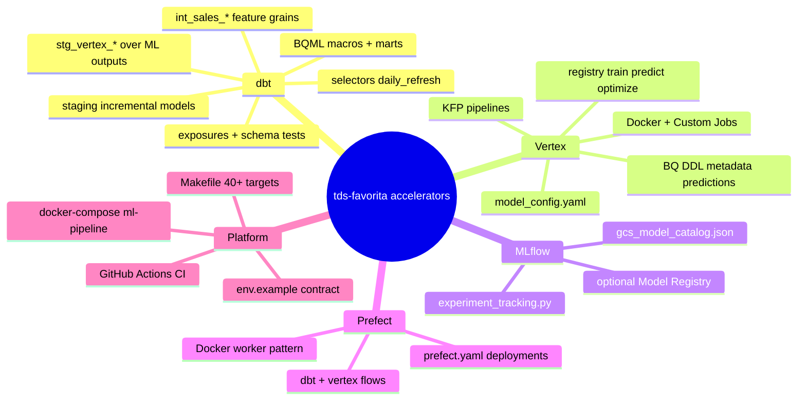



# Accelerators — reusable delivery assets

Accelerators are **pre-built components** in this repository that shorten client engagements. They are opinionated but config-driven so they adapt without fork-per-client code.

---

## Accelerator map

---

## dbt accelerators

| Asset | Path | Purpose |
|-------|------|---------|
| Staging layer | `dbt/models/staging/` | Incremental cleansed tables from `raw_favorita` |
| Feature tables | `dbt/models/intermediate/int_sales_*.sql` | Partitioned ML features at four grains |
| BQML marts | `dbt/models/marts/ml_models/` | Train, predict, evaluate, explain via macros |
| Vertex staging | `dbt/models/staging/stg_vertex_*.sql` | Views over Vertex-written BQ tables |
| Sources | `dbt/models/sources/vertex.yml` | Contract for ML output tables |
| Selectors | `dbt/selectors.yml` | `daily_refresh`, `ml_features`, `bqml_train`, `bqml_score` |
| Exposures | `dbt/models/exposures.yml` | Lineage to ML, dashboard, and app consumers |
| Docs | `docs/` | Overview + consulting package (`dbt_project.yml` → `docs-paths: ["../docs"]`) |

**Commands:** `make dbt-run`, `make dbt-train`, `make dbt-predict`, `make dbt-vertex`, `make dbt-test`

→ Product view: [dbt/consulting_package.md](dbt/consulting_package.md)

---

## Vertex AI accelerators

| Asset | Path | Purpose |
|-------|------|---------|
| Config loader | `vertex/config/load_config.py` | Merge defaults, validate per step |
| Job configs | `vertex/config/model_config.yaml` | Named train / predict / optimize + pipelines |
| Runners | `vertex/jobs/run.py`, `submit.py`, `submit_pipeline.py` | Docker, Custom Job, PipelineJob entrypoints |
| Model registry | `vertex/models/registry.py` | `(model_type, step)` → Python module |
| Families | `vertex/models/xgboost/`, `sklearn/`, `timeseries/` | XGBoost, RF, ARIMA, SARIMA |
| Predictions schema | `vertex/utils/predictions.py` | Unified prediction fact rows |
| Experiment tracking | `vertex/utils/experiment_tracking.py` | MLflow + Vertex Experiments |
| MLflow catalog | `vertex/utils/mlflow_catalog.py` | GCS pointer artifacts |
| BQ DDL | `vertex/ddl/vertex_bq_tables.sql` | Metadata, performance, predictions, job runs |
| Ops runbook | `vertex/ops/README.md` | IAM, GCS layout, Scheduler, monitoring |
| KFP compile | `vertex/pipelines/compile.py` | CI-validated pipeline JSON |

**Commands:** `make vertex-train`, `make vertex-predict`, `make vertex-optimize`, `make vertex-pipeline-submit`, `make vertex-bq-ddl`

**Model types:** `xgboost`, `random_forest`, `arima`, `sarima`

→ Product view: [vertex/consulting_package.md](vertex/consulting_package.md)

---

## MLflow accelerators

| Asset | Path | Purpose |
|-------|------|---------|
| Tracking integration | `vertex/utils/experiment_tracking.py` | Params, metrics, tags on every job step |
| GCS catalog | `vertex/utils/mlflow_catalog.py` | `gcs_model_catalog.json` on train runs |
| Config defaults | `model_config.yaml` → `defaults.mlflow` | Experiment name, register_model, tracking URI |
| Local UI | `make mlflow-ui` | Port 5001, `./mlruns` bind mount |
| Env contract | `env.example` | `MLFLOW_TRACKING_URI`, `MLFLOW_REGISTER_MODEL` |

GCS remains **canonical** for model binaries; MLflow stores pointers, not duplicate joblib files.

→ Product view: [mlflow/consulting_package.md](mlflow/consulting_package.md)

---

## Prefect accelerators

| Asset | Path | Purpose |
|-------|------|---------|
| Flows | `orchestration/flows/` | dbt run, Vertex train, ML pipeline |
| Tasks | `orchestration/tasks/` | In-container python/dbt (no nested Docker) |
| Deployments | `prefect.yaml` | Manual + scheduled deployments |
| Makefile targets | `make prefect-*` | Server, worker, deploy, trigger |

**Deployments:**

| Name | Schedule | Workload |
|------|----------|----------|
| `prefect-dbt-run-scheduled` | Daily 06:00 UTC | Feature refresh |
| `prefect-vertex-train-model-schedule` | Daily 07:00 UTC | Training |
| `prefect-vertex-ml-pipeline-scheduled` | Sun 08:00 UTC | optimize → train → predict |

→ Product view: [prefect/consulting_package.md](prefect/consulting_package.md)

---

## Platform accelerators

| Asset | Purpose |
|-------|---------|
| `Dockerfile` | Multi-stage runtime + dev image (Python 3.11) |
| `docker-compose.yml` | `ml-pipeline` service with GCP creds mount |
| `Makefile` | Single interface for dbt, Vertex, MLflow, Prefect |
| `requirements.txt` / `requirements-dev.txt` | Locked pip deps via pip-tools |
| `.github/workflows/ci.yml` | Lint, test, config validate, KFP compile, dbt parse |
| `.github/workflows/docs.yml` | Hosted dbt Docs on GitHub Pages |
| `scripts/load_favorita_to_bigquery.py` | GCS → raw BigQuery ingestion |
| `scripts/apply_vertex_bq_ddl.py` | Apply Vertex output DDL |

---

## Customization levers (per client)

| Lever | Where to change |
|-------|-----------------|
| Feature grain | Add / modify `int_sales_*`, point `train_sql_query` in YAML |
| New model family | `vertex/models/<family>/` + registry + YAML configs |
| BQML model | `dbt_project.yml` → `vars.model_configs` |
| Schedule | `prefect.yaml` or Cloud Scheduler (prod) |
| Cost tier | BQML-only vs Vertex pipelines; `machine_type`, `trial_count` |
| Tracking store | `MLFLOW_TRACKING_URI=gs://...` |
| Chargeback | `GCP_CLIENT_LABEL`, `vertex.labels` in YAML |

---

## Related documents

- [Reference architecture](reference_architecture.md)
- [Client rollout](client_rollout.md) — when to deploy each accelerator
- [Delivery artifacts](delivery_artifacts.md)


