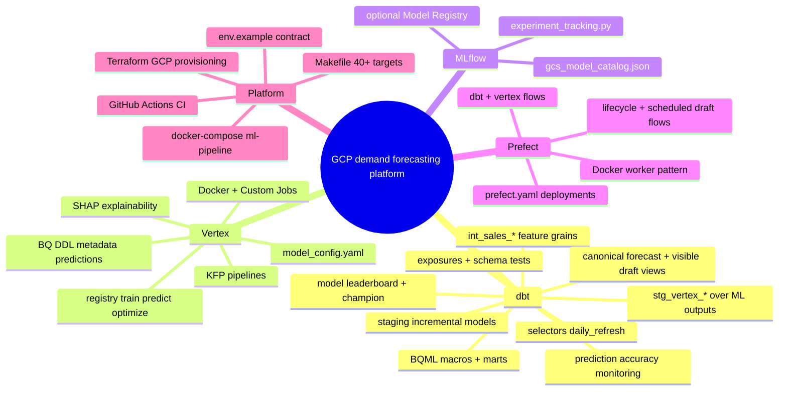



# Accelerators — reusable delivery assets

Accelerators are **pre-built components** in this repository that shorten client engagements. They are opinionated but config-driven so they adapt without fork-per-client code.

---

## Accelerator map

```mermaid
mindmap
  root((GCP demand forecasting platform))
    dbt
      staging incremental models
      int_sales_* feature grains
      BQML macros + marts
      stg_vertex_* over ML outputs
      model leaderboard + champion
      prediction accuracy monitoring
      canonical forecast + visible draft views
      exposures + schema tests
      selectors daily_refresh
    Vertex
      model_config.yaml
      registry train predict optimize
      SHAP explainability
      KFP pipelines
      BQ DDL metadata predictions
      Docker + Custom Jobs
    MLflow
      experiment_tracking.py
      gcs_model_catalog.json
      optional Model Registry
    Prefect
      prefect.yaml deployments
      dbt + vertex flows
      lifecycle + scheduled draft flows
      Docker worker pattern
    Platform
      Makefile 40+ targets
      docker-compose ml-pipeline
      GitHub Actions CI
      env.example contract
      Terraform GCP provisioning
```

---

## dbt accelerators

| Asset | Path | Purpose |
|-------|------|---------|
| Staging layer | `dbt/models/staging/` | Project-specific cleansed source tables |
| Feature tables | `dbt/models/intermediate/int_sales_*.sql` | Project-specific partitioned ML features at selected grains |
| BQML marts | `dbt/models/marts/ml_models/` | Train, predict, evaluate, explain via macros |
| Vertex staging | `dbt/models/staging/stg_vertex_*.sql` | Views over Vertex-written BQ tables |
| Model leaderboard | `ml_model_leaderboard`, `ml_model_champion` | Unified BQML + Vertex metrics, ranked, champion-flagged per grain |
| Accuracy monitoring | `ml_prediction_accuracy_rolling`, `assert_no_material_accuracy_drift` | Rolling 7d/28d live accuracy vs. training-time metrics, with a drift test |
| Forecast consumption | `stg_forecast_*`, `forecast_visible_drafts` | Contracted run/output/stage/gate views with atomic consumer visibility |
| Sources | `dbt/models/sources/vertex.yml` | Contract for ML output tables |
| Selectors | `dbt/selectors.yml` | `daily_refresh`, `ml_features`, `bqml_train`, `bqml_score` |
| Exposures | `dbt/models/exposures.yml` | Lineage to ML, dashboard, and app consumers |
| Docs | `docs/` | Overview + platform guide (`dbt_project.yml` → `docs-paths: ["../docs"]`) |

**Commands:** `make dbt-run`, `make dbt-train`, `make dbt-predict`, `make dbt-vertex`, `make dbt-test`, `make selector-accuracy-monitoring`

→ Product view: [dbt/component_guide.md](dbt/component_guide.md)

---

## Vertex AI accelerators

| Asset | Path | Purpose |
|-------|------|---------|
| Config loader | `vertex/config/load_config.py` | Merge defaults, validate per step |
| Job configs | `vertex/config/model_config.yaml` | Named train / predict / optimize + pipelines |
| Runners | `vertex/jobs/run.py`, `submit.py`, `submit_pipeline.py` | Docker, Custom Job, PipelineJob entrypoints |
| Model registry | `vertex/models/registry.py` | `(model_type, step)` → Python module |
| Families | `vertex/models/xgboost/`, `sklearn/`, `timeseries/`, `prophet/` | XGBoost, RF, ARIMA, SARIMA, Prophet |
| Forecast contracts | `vertex/config/forecast_contract.py`, `forecast_contract.yaml` | Validated grain, horizon, quantile, routing, calibration, and provenance contract |
| Forecasting methods | `vertex/models/xgboost/direct_multi_horizon.py`, `vertex/evaluation/` | Seven-horizon direct scoring, baselines, routing, calibration, reconciliation, and lifecycle gates |
| Predictions schema | `vertex/utils/predictions.py` | Unified prediction fact rows |
| Explainability | `vertex/utils/explain.py`, `stg_vertex_model_explain` | Per-prediction SHAP top-K feature attributions (xgboost, random_forest) |
| Experiment tracking | `vertex/utils/experiment_tracking.py` | MLflow + Vertex Experiments |
| MLflow catalog | `vertex/utils/mlflow_catalog.py` | GCS pointer artifacts |
| BQ DDL | `vertex/ddl/vertex_bq_tables.sql` | Metadata, predictions, backtests, lifecycle, canonical forecasts, stages, gates, and operations |
| Ops runbook | `vertex/ops/README.md` | IAM, GCS layout, Scheduler, monitoring |
| KFP compile | `vertex/pipelines/compile.py` | CI-validated pipeline JSON |

**Commands:** `make vertex-train`, `make vertex-predict`, `make vertex-optimize`, `make vertex-pipeline-submit`, `make vertex-bq-ddl`, `make vertex-forecast-contract-accept`

**Model types:** `xgboost`, `random_forest`, `arima`, `sarima`, `prophet`

→ Product view: [vertex/component_guide.md](vertex/component_guide.md)

---

## MLflow accelerators

| Asset | Path | Purpose |
|-------|------|---------|
| Tracking integration | `vertex/utils/experiment_tracking.py` | Params, metrics, tags on every job step |
| GCS catalog | `vertex/utils/mlflow_catalog.py` | `gcs_model_catalog.json` on train runs |
| Config defaults | `model_config.yaml` → `defaults.mlflow` | Experiment name, register_model, tracking URI |
| Local UI | `make mlflow-ui` | Port 5001, `./mlruns` bind mount |
| Env contract | `env.example` | `MLFLOW_TRACKING_URI`, `MLFLOW_REGISTER_MODEL` |

GCS remains **canonical** for model binaries; MLflow stores pointers, not duplicate joblib files.

→ Product view: [mlflow/component_guide.md](mlflow/component_guide.md)

---

## Prefect accelerators

| Asset | Path | Purpose |
|-------|------|---------|
| Flows | `orchestration/flows/` | dbt, Vertex, model lifecycle, scheduled atomic draft, and gated publication |
| Tasks | `orchestration/tasks/` | In-container python/dbt (no nested Docker) |
| Deployments | `prefect.yaml` | Manual + scheduled deployments |
| Makefile targets | `make prefect-*` | Server, worker, deploy, trigger |

**Deployments:**

| Name | Schedule | Workload |
|------|----------|----------|
| `prefect-dbt-run-scheduled` | Daily 06:00 UTC | Feature refresh |
| `prefect-vertex-train-model-schedule` | Daily 07:00 UTC | Training |
| `prefect-vertex-ml-pipeline-scheduled` | Sun 08:00 UTC | optimize → train → predict |
| `prefect-model-lifecycle-scheduled` | Sun 10:00 UTC | Rolling-origin evaluation and governed champion promotion |
| `prefect-scheduled-forecast-pipeline-daily` | Daily 09:00 UTC | Champion scoring through validated atomic draft visibility |
| `prefect-forecast-publication-manual` | On demand | Validate or idempotently publish a canonical run |

→ Product view: [prefect/component_guide.md](prefect/component_guide.md)

---

## Platform accelerators

| Asset | Purpose |
|-------|---------|
| `Dockerfile` | Multi-stage runtime + dev image (Python 3.11) |
| `docker-compose.yml` | `ml-pipeline` service with GCP creds mount |
| `Makefile` | Single interface for dbt, Vertex, MLflow, Prefect |
| `requirements.txt` / `requirements-dev.txt` | Locked pip deps via pip-tools |
| `.github/workflows/ci.yml` | Lint, test, config validate, KFP compile, dbt parse |
| `.github/workflows/docs.yml` | Hosted Docsify portal and dbt Docs on GitHub Pages |
| Raw-data loader scripts | GCS → raw BigQuery ingestion pattern; replace or extend per project |
| `scripts/apply_vertex_bq_ddl.py` | Apply Vertex output DDL |
| Governed forecast publication | Contract-pinned champion scoring, point-in-time evidence, stage/gate audit, locks, and atomic drafts |
| `terraform/` | Versioned GCP provisioning: APIs, IAM, BigQuery datasets, GCS buckets, Artifact Registry per environment |
| `.github/workflows/terraform.yml` | `fmt`/`validate` on every PR touching `terraform/` |

---

## Customization levers (per client)

| Lever | Where to change |
|-------|-----------------|
| Feature grain | Add / modify project dbt feature models, point `train_sql_query` in YAML |
| New model family | `vertex/models/<family>/` + registry + YAML configs |
| BQML model | `dbt_project.yml` → `vars.model_configs` |
| Schedule | `prefect.yaml` or Cloud Scheduler (prod) |
| Cost tier | BQML-only vs Vertex pipelines; `machine_type`, `trial_count` |
| Tracking store | `MLFLOW_TRACKING_URI=gs://...` |
| Chargeback | `GCP_CLIENT_LABEL`, `vertex.labels` in YAML |

## Reuse boundary

The reusable accelerators are the GCP platform patterns, model execution framework, metadata tables, orchestration, tracking, testing conventions, and docs structure. The dbt source and feature models are expected to change by project. They form the canonical adapter from raw client data into forecast-ready tables; a formal plugin or connector framework is intentionally out of scope for now.

---

## Related documents

- [Reference architecture](reference_architecture.md)
- [Client rollout](client_rollout.md) — when to deploy each accelerator
- [Delivery artifacts](delivery_artifacts.md)


