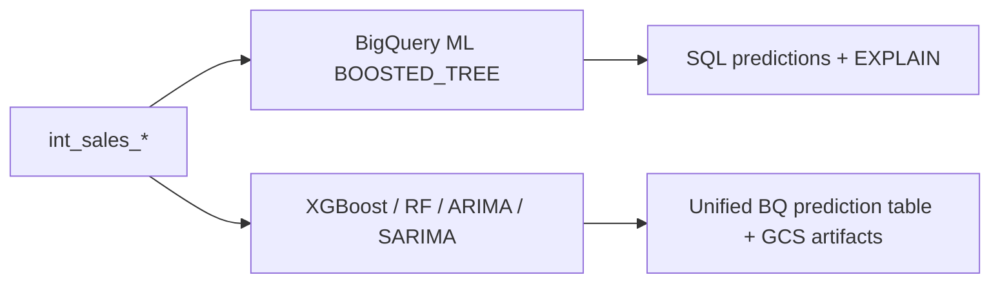



# Case study — Favorita demand forecasting on GCP

**Client context (synthetic):** A multi-store grocery retailer needs daily store-level sales forecasts that account for promotions, Ecuadorian holidays, and macro signals (oil prices). Data lives in BigQuery; the analytics team uses dbt; ML engineers want both quick baselines and tunable custom models.

**Engagement type:** Reference implementation / accelerator — built on public [Kaggle Favorita data](https://www.kaggle.com/competitions/favorita-grocery-sales-forecasting) to demonstrate The Data Strategist's GCP forecasting delivery pattern.

---

## Business problem

Retailers must answer:

> *How much will each store sell tomorrow — and over the next week — by category and SKU, given promotions and calendar effects?*

Poor forecasts drive **overstock, stockouts, and wasted labor** in replenishment and staffing. The Favorita dataset captures this at store × product × day granularity with rich promotion and holiday metadata — an ideal public proxy for client conversations.

### Success criteria

| Criterion | Target |
|-----------|--------|
| **Reproducible features** | Single governed feature layer in BigQuery, documented in dbt |
| **Multiple model paths** | Warehouse-native baseline + custom Python for advanced algorithms |
| **Auditable outputs** | Predictions, metadata, and job runs queryable in SQL |
| **Operational refresh** | Scheduled pipeline: features → train → predict |
| **Handoff-ready** | Docker, config YAML, CI, ops runbook |

---

## Constraints

| Constraint | Implication |
|------------|-------------|
| GCP-first stack | BigQuery + Vertex AI + GCS (no alternate warehouse) |
| Small platform team | Prefer config over custom code per model |
| Cost sensitivity | BQML for baseline; Vertex for tuning and time-series |
| Governance | dbt tests, exposures, lineage for ML consumers |
| Public demo data | No PII; suitable for open-source showcase |

---

## Approach

### 1. Analytics engineering first

Raw competition CSVs land in `raw_favorita`. dbt builds:

- **Staging** — typed, incremental tables; Ecuador holiday logic; oil price alignment
- **Intermediate** — `int_sales_*` at company, store, store-product, and family grains
- **Tests** — grain uniqueness, `not_null`, row-count assertions

*Why:* ML quality ceiling is set by features. Governed SQL features are reusable by BQML, Vertex, and BI.

### 2. Dual ML paths on shared features

- **BQML** — fastest path to a boosted-tree baseline with `EVALUATE` and global feature attribution in SQL
- **Vertex** — Optuna hyperparameter search, multi-algorithm registry, KFP pipelines, GCS model artifacts

*Why:* Clients rarely commit to one ML platform on day one. This architecture supports a phased roadmap.

### 3. Config-driven custom ML

All Vertex jobs are declared in `vertex/config/model_config.yaml` — train SQL, target column, model params, GCS paths, and output tables. New models register in `vertex/models/registry.py` without new CLI scripts.

### 4. Orchestration and observability

Prefect OSS schedules dbt and ML pipelines locally; production maps to Cloud Scheduler + Cloud Run. Every Vertex job logs to **BigQuery** (metadata, performance), **MLflow** (metrics + GCS catalog), and **Vertex Experiments**.

### 5. Production path documented

`vertex/ops/README.md` covers least-privilege IAM, GCS layout, chargeback labels, and monitoring queries — ready to adapt per client org.

---

## Outcomes (reference implementation)

Outcomes below reflect **architectural deliverables**. Numeric benchmarks are populated per environment — see [benchmarks.md](benchmarks.md).

| Outcome | Evidence in repo |
|---------|------------------|
| End-to-end feature pipeline | `make dbt-run` → four `int_sales_*` tables |
| BQML baseline | `make dbt-train`, `bqml_model_evaluate` |
| Four Vertex model families | XGBoost, RF, ARIMA, SARIMA configs in YAML |
| Hyperparameter search | Optuna optimize step + `favorita_model_optimize` table |
| Unified predictions | `favorita_model_predictions` + `stg_vertex_model_predictions` |
| Experiment tracking | MLflow UI (`make mlflow-ui`), Vertex Experiments |
| CI without GCP | GitHub Actions: lint, test, config validate, KFP compile |
| Lineage for ML consumers | `dbt/models/exposures.yml` |

---

## What we would change for a real client

| Area | Reference repo | Typical client adaptation |
|------|----------------|---------------------------|
| Data source | Kaggle CSVs in GCS | ERP / POS / promo feeds, incremental loads |
| Grain | Store-day default for Vertex | SKU-level or DC-level per use case |
| Orchestration | Prefect OSS in Docker | Cloud Composer, Workflows, or client scheduler |
| Auth | Service account JSON (dev) | Workload Identity Federation, Secret Manager |
| Dashboard | Blueprint only | Looker, Looker Studio, or embedded app |
| Model champion | Manual comparison | Automated leaderboard mart + alerts |
| Cost | Dev-sized queries | Partition pruning, BQ reservations, spot/preemptible Vertex |

---

## Technology choices (summary)

| Choice | Rationale |
|--------|-----------|
| **dbt on BigQuery** | Industry-standard analytics engineering; docs + lineage |
| **BigQuery ML** | Low-lift baseline inside the warehouse |
| **Vertex Custom Jobs** | Full Python control, Artifact Registry image |
| **KFP Pipelines** | optimize → train → predict as one auditable unit |
| **MLflow** | Portable experiment tracking; GCS remains artifact source of truth |
| **Prefect OSS** | Lightweight orchestration without managed Composer cost for demos |
| **Docker + Makefile** | Repeatable local and CI environment |

---

## Related documents

- [Reference architecture](reference_architecture.md) — diagrams and flows
- [Benchmarks](benchmarks.md) — metric comparison template
- [Client rollout](client_rollout.md) — engagement timeline
- [Consulting package](consulting_package.md) — full package overview


