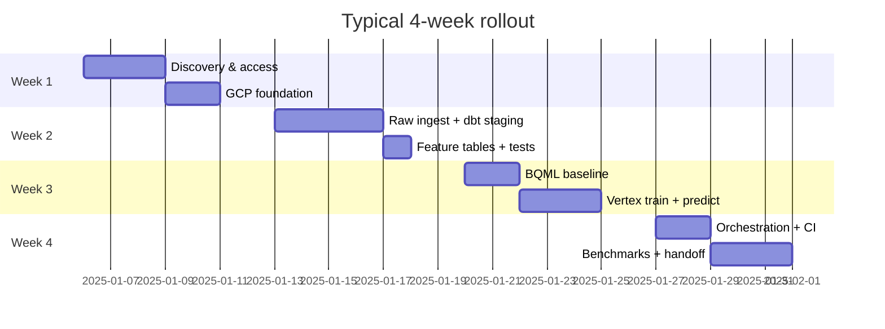



# Client rollout playbook

Four-week template for deploying the Favorita forecasting **accelerator pattern** on a client GCP organization. Adjust duration based on data readiness and enterprise gates (IAM, VPC-SC, InfoSec review).

---

## Overview

---

## Week 1 — Discovery and foundation

### Goals

- Confirm business grain (company / store / SKU), forecast horizon, and refresh SLA
- Provision GCP resources and access
- Fork / clone accelerator repo for client namespace

### Activities

| Day | Activity | Owner | Deliverable |
|-----|----------|-------|-------------|
| 1–2 | Stakeholder interviews: planning, merchandising, data | Consulting | Requirements doc |
| 2 | Map source systems → raw BigQuery landing pattern | Consulting + client DE | Source inventory |
| 3 | Create GCP projects (dev/prod), APIs, datasets | Platform | Project IDs documented |
| 3–4 | GCS buckets: raw, staging, models, pipeline root | Platform | Bucket URIs in `.env` |
| 4 | Service account + IAM per [iac.md](iac.md) | Platform | SA email, role worksheet |
| 5 | Artifact Registry + first Docker image push | Platform | `VERTEX_TRAINING_IMAGE` |
| 5 | Client `.env` from `env.example` | Consulting | Configured dev environment |

### Exit criteria

- [ ] `make docker-build` succeeds on client machine or CI
- [ ] `dbt debug` connects to client BigQuery
- [ ] Service account can read/write target datasets and GCS buckets

---

## Week 2 — Data and features

### Goals

- Land raw data (or Favorita demo data for POC)
- Run dbt staging + intermediate through first successful `dbt test`

### Activities

| Day | Activity | Commands / artifacts |
|-----|----------|---------------------|
| 1–2 | Adapt load script or client ingest | `scripts/load_favorita_to_bigquery.py` or client ETL |
| 2–3 | Customize staging models if source differs | `dbt/models/staging/` |
| 3–4 | Build / validate `int_sales_*` grains | `make dbt-run`, `make dbt-test` |
| 4 | Apply Vertex output DDL | `make vertex-bq-ddl` |
| 5 | Review dbt Docs lineage with client | `make dbt-docs-generate`, exposures walkthrough |

### Exit criteria

- [ ] `raw_favorita` (or client raw dataset) populated
- [ ] `int_sales_store_daily` (or chosen grain) passes tests
- [ ] Vertex BQ tables exist

---

## Week 3 — ML paths

### Goals

- BQML baseline at executive grain
- Vertex train + predict at operational grain
- First benchmark numbers in [benchmarks.md](benchmarks.md)

### Activities

| Day | Activity | Commands |
|-----|----------|----------|
| 1 | BQML train + evaluate | `make dbt-train`, review `bqml_model_evaluate` |
| 1–2 | Configure `model_config.yaml` for client project/dataset | Edit `train_sql_query`, `gcs_model_path` |
| 2–3 | Vertex train + predict (Docker) | `make vertex-train`, `make vertex-predict` |
| 3 | MLflow review | `make mlflow-ui` |
| 4 | Optional: Vertex Custom Job in GCP | `make vertex-train VERTEX_MODE=vertex SYNC=1` |
| 4–5 | Optional: KFP pipeline | `make vertex-pipeline-submit SYNC=1` |
| 5 | Populate benchmark table | SQL from [benchmarks.md](benchmarks.md) |

### Exit criteria

- [ ] Rows in `favorita_model_metadata` and `favorita_model_predictions`
- [ ] At least one BQML and one Vertex model with documented test metrics
- [ ] Client agrees on champion candidate

---

## Week 4 — Operations and handoff

### Goals

- Schedule refreshes
- Enable CI for client repo fork
- Transfer knowledge and ops runbook

### Activities

| Day | Activity | Commands / artifacts |
|-----|----------|---------------------|
| 1 | Prefect or Cloud Scheduler setup | `make prefect-deploy` or [iac.md](iac.md) Scheduler |
| 1–2 | Wire dbt → Vertex order (features before train) | Prefect pipeline flow or Workflows YAML |
| 2 | CI in client GitHub | `.github/workflows/ci.yml` |
| 3 | Monitoring queries | `favorita_vertex_job_runs` FAILED filter |
| 3–4 | Dashboard POC (optional) | Looker Studio on `stg_vertex_model_predictions` |
| 4–5 | Handoff session: Makefile, YAML configs, ops README | `vertex/ops/README.md` |
| 5 | Backlog: champion mart, Terraform, WIF | Prioritized with client |

### Exit criteria

- [ ] Scheduled daily dbt + weekly ML pipeline (or documented prod schedule)
- [ ] On-call / owner knows how to re-run failed jobs
- [ ] Benchmark doc completed
- [ ] Handoff deck with architecture diagram from [reference_architecture.md](reference_architecture.md)

---

## Roles and responsibilities

| Role | Responsibilities |
|------|------------------|
| **Engagement lead** | Scope, stakeholder comms, case study narrative |
| **Analytics engineer** | dbt models, tests, exposures, dbt Docs |
| **ML engineer** | `model_config.yaml`, Vertex jobs, benchmarks |
| **Platform / DevOps** | GCP, IAM, CI, Scheduler, Artifact Registry |
| **Client data owner** | Source access, UAT on forecasts, champion sign-off |

---

## Risk register (common)

| Risk | Mitigation |
|------|------------|
| Source data quality | Staging tests + row-count assertions early |
| IAM delays | Week 1 dedicated; use dev SA with minimal scope first |
| Cost overrun on Vertex | Start Docker-local; use `SKIP_OPTIMIZE=1`, cap `max_entities` |
| Wrong forecast grain | Week 1 sign-off on grain + horizon |
| No consumption layer | Dashboard blueprint in week 4; expose via `stg_vertex_*` |

---

## Post-rollout (weeks 5–8 optional)

| Enhancement | Accelerator base |
|-------------|------------------|
| Model leaderboard mart | `favorita_model_performance` + dbt mart |
| Drift / accuracy monitoring | dbt tests on prediction vs actual |
| Terraform modules | [iac.md](iac.md) roadmap |
| Workload Identity Federation | Replace SA keys |
| Prophet / deep learning family | `vertex/models/registry.py` pattern |

---

## Related documents

- [Accelerators](accelerators.md)
- [IaC](iac.md)
- [Delivery artifacts](delivery_artifacts.md)
- [Case study](case_study.md)


