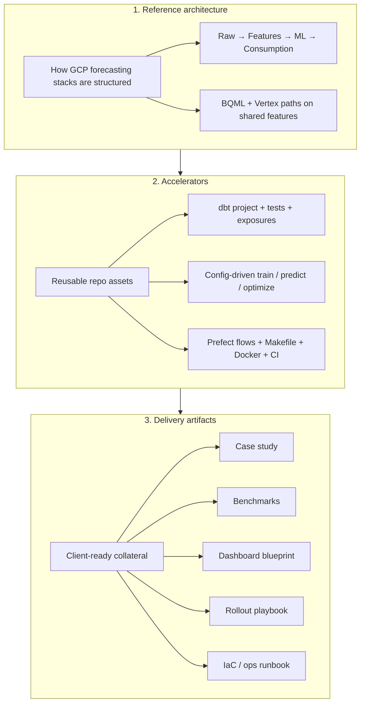



# Consulting package — Favorita forecasting on GCP

This repository is a **productized engagement** from [The Data Strategist](https://www.thedatastrategist.com): a reference implementation of a modern grocery demand-forecasting stack on Google Cloud, built on public [Favorita competition](https://www.kaggle.com/competitions/favorita-grocery-sales-forecasting) data.

It is designed for three audiences:

| Audience | What to read first |
|----------|-------------------|
| **Executive / business** | [Case study](case_study.md) — problem, approach, outcomes |
| **Platform / data engineering** | [Reference architecture](reference_architecture.md) — layers, flows, GCP services |
| **Delivery team** | [Accelerators](accelerators.md) + [Client rollout](client_rollout.md) |

Product-specific views: [dbt](dbt/consulting_package.md) · [Vertex AI](vertex/consulting_package.md) · [MLflow](mlflow/consulting_package.md) · [Prefect](prefect/consulting_package.md)

---

## Three-layer package

### Layer 1 — Reference architecture

Documents **how** a production GCP forecasting platform is structured: ingestion, analytics engineering, dual ML paths (warehouse-native and custom Python), orchestration, experiment tracking, and consumption.

→ Full detail: [reference_architecture.md](reference_architecture.md)

### Layer 2 — Accelerators

Shippable code and configuration that compresses time-to-value on client projects:

- dbt models (`staging` → `intermediate` → `marts`) with grain tests and lineage exposures
- Vertex registry + `model_config.yaml` for XGBoost, Random Forest, ARIMA, SARIMA
- Prefect deployments for daily dbt and weekly ML pipelines
- MLflow + Vertex Experiments on every job run
- Docker image, Makefile targets, GitHub Actions CI

→ Inventory: [accelerators.md](accelerators.md)

### Layer 3 — Delivery artifacts

Collateral used in sales, kickoff, and handoff:

| Artifact | Location | Status |
|----------|----------|--------|
| Case study | [case_study.md](case_study.md) | Available |
| Benchmarks | [benchmarks.md](benchmarks.md) | Template + query recipes |
| Dashboard blueprint | [delivery_artifacts.md](delivery_artifacts.md#dashboard-blueprint) | Blueprint (BI layer planned) |
| Client rollout playbook | [client_rollout.md](client_rollout.md) | Available |
| IaC / GCP ops | [iac.md](iac.md) + `vertex/ops/README.md` | Runbook available; Terraform roadmap |

→ Index: [delivery_artifacts.md](delivery_artifacts.md)

---

## Engagement positioning

**What clients buy:** not a Kaggle notebook, but a **repeatable delivery pattern** — governed features in BigQuery, choice of BQML vs custom Vertex models, orchestrated refresh, auditable predictions, and a path to production IAM/scheduling.

**What we customize per client:** dataset and grains, model families, schedules, cost tier (BQML-only vs full Vertex pipelines), BI tool, and enterprise controls (VPC-SC, WIF, CMEK).

**Proof points in this repo:**

- End-to-end lineage in dbt Docs (including exposures for ML consumers)
- Same feature tables feed BQML and Vertex
- Config-driven ML without fork-per-model scripts
- CI validates configs, compiles KFP pipelines, and runs unit tests without GCP

---

## Quick navigation

| Topic | Document |
|-------|----------|
| Architecture diagrams & data flows | [reference_architecture.md](reference_architecture.md) |
| Repo accelerators (files, commands) | [accelerators.md](accelerators.md) |
| Case study narrative | [case_study.md](case_study.md) |
| Model benchmarks | [benchmarks.md](benchmarks.md) |
| 4-week rollout | [client_rollout.md](client_rollout.md) |
| GCP IAM, scheduling, IaC | [iac.md](iac.md) |
| dbt-only view | [dbt/consulting_package.md](dbt/consulting_package.md) |
| Vertex-only view | [vertex/consulting_package.md](vertex/consulting_package.md) |
| MLflow-only view | [mlflow/consulting_package.md](mlflow/consulting_package.md) |
| Prefect-only view | [prefect/consulting_package.md](prefect/consulting_package.md) |


