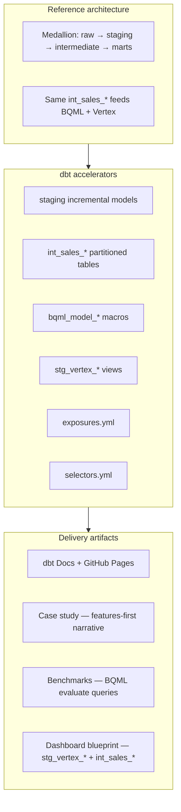
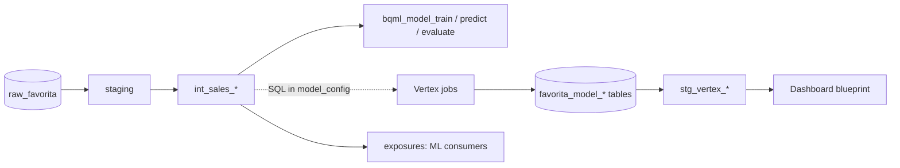



# dbt consulting package — Favorita forecasting

**dbt's role** in this engagement: govern the **analytics engineering layer** — raw → staging → ML features → BQML marts → Vertex output staging — with tests, lineage, and documented exposures for ML and BI consumers.

Parent overview: [consulting_package.md](../consulting_package.md)

---

## dbt in the three-layer package



---

## Reference architecture (dbt lens)

| Layer | Models | Materialization | Tags |
|-------|--------|-----------------|------|
| **Sources** | `raw_favorita.*` | External | — |
| **Staging** | `stg_favorita_*`, `stg_vertex_*` | Incremental / view | `staging`, `vertex` |
| **Intermediate** | `int_sales_*` | Partitioned table | `train`, `features` |
| **Marts** | `bqml_model_*` | View (BQML ops) | `bqml` |

### Data flow



---

## Accelerators (dbt-specific)

| Asset | Path |
|-------|------|
| Project config | `dbt/dbt_project.yml` |
| Staging | `dbt/models/staging/` |
| Features | `dbt/models/intermediate/int_sales_*.sql` |
| BQML | `dbt/models/marts/ml_models/`, `dbt/macros/` |
| Vertex sources | `dbt/models/sources/vertex.yml` |
| Vertex staging | `dbt/models/staging/stg_vertex_*.sql` |
| Tests | `dbt/models/*/schema.yml`, `dbt/tests/` |
| Selectors | `dbt/selectors.yml` |
| Exposures | `dbt/models/exposures.yml` |
| Overview | `docs/overview.md` |

### Key commands

```bash
make dbt-run              # staging + intermediate (excludes bqml)
make dbt-train            # BQML CREATE MODEL
make dbt-predict          # BQML batch predict
make dbt-vertex           # stg_vertex_* over ML outputs
make dbt-test             # data quality
make dbt-docs-generate    # catalog + lineage
```

### Feature grains (consulting talking points)

| Model | Grain | Default for |
|-------|-------|-------------|
| `int_sales_daily` | company-day | BQML, executive forecast |
| `int_sales_store_daily` | store-day | Vertex XGBoost / RF / ARIMA |
| `int_sales_store_product_daily` | store-SKU-day | Item demand |
| `int_sales_store_product_family_daily` | store-family-day | Category planning |

---

## Delivery artifacts (dbt-specific)

| Artifact | How dbt supports it |
|----------|---------------------|
| **Case study** | "Analytics engineering first" — features before ML |
| **Benchmarks** | Query `bqml_model_evaluate`; join Vertex via sources |
| **Dashboard** | Expose `stg_vertex_model_predictions` + `int_sales_store_daily` |
| **Rollout** | Week 2 = dbt staging + tests; Week 4 = `dbt-vertex` |
| **Lineage** | Exposures: `favorita_company_forecast`, `favorita_vertex_predictions` |

### Exposures for client conversations

Open dbt Docs lineage and highlight:

- `favorita_company_forecast` — BQML end-to-end
- `favorita_vertex_training` — feature tables → Vertex
- `favorita_vertex_predictions` — unified ML outputs → BI
- `favorita_operational_calendar` — holiday / oil context

---

## Client customization (dbt)

1. Add client sources in `dbt/models/raw/` or update `sources.yml`
2. Adapt staging column names / grains
3. Add or trim `int_sales_*` feature columns
4. Register new BQML config in `dbt_project.yml` → `vars.model_configs`
5. Add dashboard exposure when BI layer exists

---

## Related documents

- [Full reference architecture](../reference_architecture.md)
- [Accelerators](../accelerators.md)
- [Client rollout](../client_rollout.md) — Week 2 dbt focus
- Other products: [Vertex](../vertex/consulting_package.md) · [MLflow](../mlflow/consulting_package.md) · [Prefect](../prefect/consulting_package.md)


