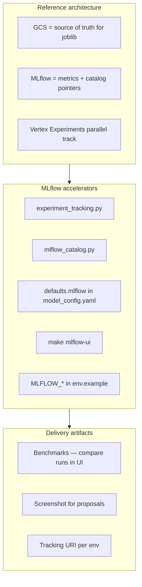
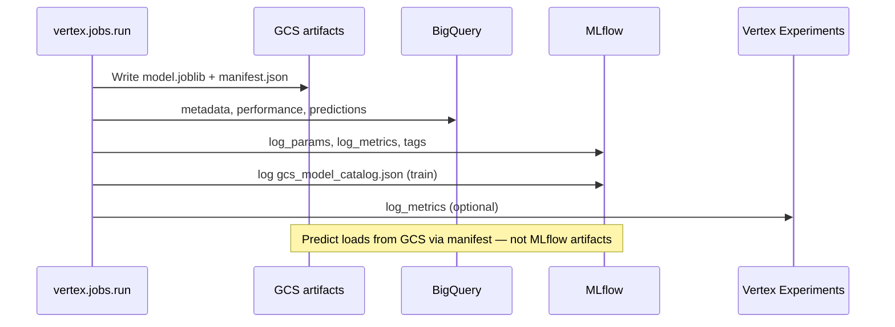



# MLflow consulting package — Favorita forecasting

**MLflow's role** in this engagement: provide **portable experiment tracking** and optional **Model Registry catalog entries** while **GCS remains the canonical store** for model binaries. Every Vertex train, predict, and optimize job logs params, metrics, and tags.

Parent overview: [consulting_package.md](../consulting_package.md)

---

## MLflow in the three-layer package



---

## Reference architecture (MLflow lens)



### Design principle: GCS canonical + MLflow catalog

| Store | Holds |
|-------|-------|
| **GCS** | `model.joblib`, `manifest.json`, `latest_best_params.json` |
| **MLflow** | Params, metrics, tags, `gcs_model_catalog.json` sidecar |
| **BigQuery** | `favorita_model_metadata`, `mlflow_run_id` on job runs |
| **Vertex Experiments** | Duplicate metrics for GCP-native UI |

Registered MLflow models are **lightweight pointers** (kilobytes), not duplicate joblib copies.

---

## Accelerators (MLflow-specific)

| Asset | Path / command |
|-------|----------------|
| Tracking integration | `vertex/utils/experiment_tracking.py` |
| GCS catalog builder | `vertex/utils/mlflow_catalog.py` |
| Config defaults | `vertex/config/model_config.yaml` → `defaults.mlflow` |
| Tests | `vertex/tests/test_experiment_tracking.py`, `test_mlflow_catalog.py` |
| Local UI | `make mlflow-ui` → http://127.0.0.1:5001 |
| Env vars | `env.example`: `MLFLOW_TRACKING_URI`, `MLFLOW_REGISTER_MODEL`, `MLFLOW_EXPERIMENT_NAME` |

### Configuration (YAML)

```yaml
defaults:
  mlflow:
    enabled: true
    experiment_name: favorita-vertex
    vertex_experiments: true
    catalog_artifacts: true
    register_model: false
    registered_model_prefix: favorita
```

Enable Model Registry: `register_model: true` or `MLFLOW_REGISTER_MODEL=true`.

Disable all tracking: `EXPERIMENT_TRACKING_ENABLED=false`.

### What each job step logs

| Step | MLflow |
|------|--------|
| **train** | Train/test metrics, hyperparams, `gcs_model_catalog.json`, optional `models:/` version |
| **predict** | Scoring metrics, prediction counts |
| **optimize** | Trial metrics, best params |

Tags include: `job_run_id`, `config_name`, `model_type`, `model_family`, `git_sha`.

---

## Delivery artifacts (MLflow-specific)

| Artifact | MLflow contribution |
|----------|---------------------|
| **Benchmarks** | Filter runs by `config_name`; compare `test_mae`, `test_wape` |
| **Case study** | "Auditable experiments without vendor lock-in on artifacts" |
| **Demo** | `make mlflow-ui` after `make vertex-train` — screenshot for deck |
| **Rollout** | Week 3: confirm `MLFLOW_TRACKING_URI`; prod → `gs://bucket/mlflow` |
| **Handoff** | Document experiment naming convention and register_model policy |

### Benchmark workflow

```bash
make vertex-train VERTEX_TRAIN_CONFIG=favorita_xgboost
make vertex-train VERTEX_TRAIN_CONFIG=favorita_rf
make mlflow-ui
```

Compare runs in the Experiments view; cross-check with [benchmarks.md](../benchmarks.md) SQL on `favorita_model_performance`.

### Cross-system join

BigQuery `favorita_vertex_job_runs` stores `mlflow_run_id` and `vertex_experiment_run` for joining warehouse audit to MLflow UI.

---

## Environment options

| Environment | `MLFLOW_TRACKING_URI` |
|-------------|------------------------|
| Local dev | `file:./mlruns` (default, gitignored) |
| Shared team | `gs://CLIENT-mlflow` |
| Enterprise | Managed MLflow on GCE / Cloud Run |

Docker bind-mounts `./mlruns` at `/app/mlruns` for local UI.

---

## Client customization (MLflow)

1. Set per-env `MLFLOW_TRACKING_URI` and experiment name
2. Enable `register_model` when client wants Registry workflow
3. Align `registered_model_prefix` with client naming (e.g. `acme-demand`)
4. Keep predict on GCS — do not switch to MLflow artifact loading without migration plan

---

## Related documents

- [vertex/README.md — Experiment tracking](../../../vertex/README.md#experiment-tracking)
- [Benchmarks](../benchmarks.md)
- [Vertex consulting package](../vertex/consulting_package.md)
- Other products: [dbt](../dbt/consulting_package.md) · [Prefect](../prefect/consulting_package.md)


