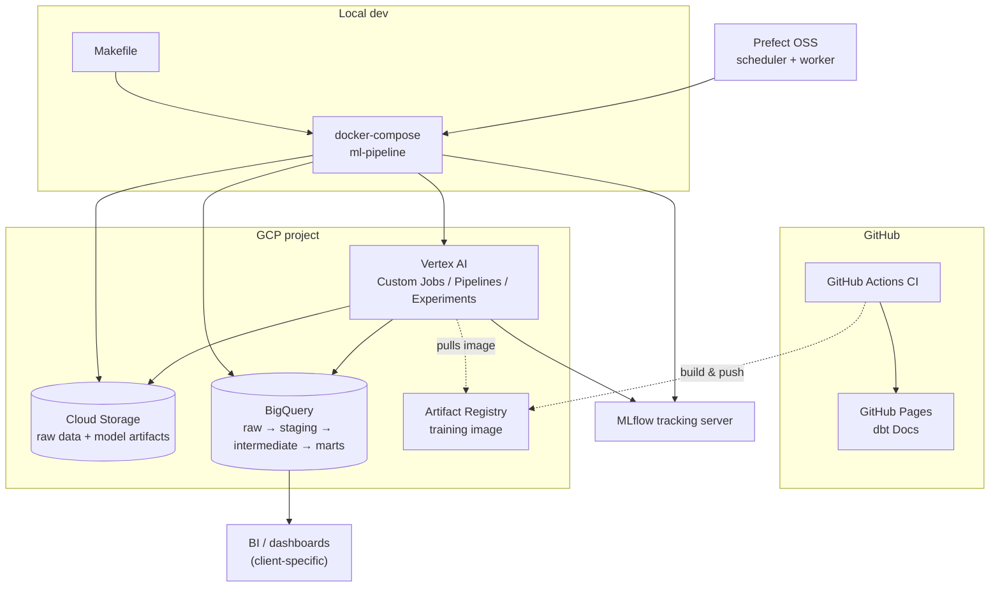
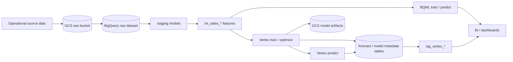



# GCP demand forecasting platform

Production-style demand forecasting platform for Google Cloud, built by [The Data Strategist](https://www.thedatastrategist.com). It demonstrates a reusable GCP pattern for governed dbt features, **BigQuery ML** baselines, **Vertex AI** custom models, experiment tracking, orchestration, and forecast operations.

The platform is intentionally **GCP-first** and intentionally **dbt-adapted per project**. Each implementation maps its own operational data into forecast-ready dbt models, because demand features, source systems, covariates, and planning grains vary by business.

## Consulting package

This project is structured as a **productized consulting engagement** with three layers:

1. **[Reference architecture](reference_architecture.md)** — how modern GCP forecasting stacks are structured
2. **[Accelerators](accelerators.md)** — reusable dbt, Vertex, MLflow, Prefect, and platform assets
3. **[Delivery artifacts](delivery_artifacts.md)** — case study, benchmarks, dashboard blueprint, rollout playbook, IaC

Start here: **[Consulting package overview](consulting_package.md)**

Product-specific views: [dbt](dbt/consulting_package.md) · [Vertex AI](vertex/consulting_package.md) · [MLflow](mlflow/consulting_package.md) · [Prefect](prefect/consulting_package.md)

## Business question

Given a project's demand history, known-future covariates, business calendar, hierarchy, and planning grain, what forecast should be generated, evaluated, approved, and delivered for each forecast origin and horizon?

## Architecture

| Layer | Dataset / location | Role |
|-------|-------------------|------|
| **Raw** | configured raw dataset | Project source data loaded from GCS / BigQuery ingestion jobs |
| **Staging** | `DBT_DATASET` | Cleaned, typed, incremental models for the project's source data, entities, calendar, and covariates |
| **Intermediate** | `DBT_DATASET` | Project-owned `int_sales_*` or equivalent feature tables at the selected planning grains |
| **Marts** | `DBT_DATASET` | BQML train / predict / evaluate / explain (tagged `bqml`); Vertex outputs staged via `stg_vertex_*` |

### System diagram

The systems involved and how they integrate (execution environments, GCP services, orchestration, tracking):

### Data flow diagram

How data itself moves through the pipeline, from raw source to consumption:

See [reference_architecture.md](reference_architecture.md) for deeper flow diagrams (operational sequence, dual ML path, security/environments, CI/CD).

## Model grains

- **Aggregate-day** — default BQML-style executive rollup grain
- **Location-day** — default Vertex-style operational planning grain
- **Location-product-day** — item-level demand planning grain
- **Location-product-family-day** — category planning grain

The checked-in dbt project names these models with `int_sales_*` conventions. A new implementation should keep the platform contracts stable while adapting the dbt feature models to the business's own entities and covariates.

## How to run

1. Load raw data into BigQuery
2. Build features (excludes BQML): `make dbt-run`
3. **BQML path:** `make dbt-train` then `make dbt-predict`
4. **Vertex path:** `make vertex-train` / `make vertex-predict` (see `vertex/config/model_config.yaml`)
5. **Vertex staging in dbt:** `make dbt-vertex`

For a controlled reset or recovery that preserves the raw dataset and reconstructs the derived dataset, use the [Clean Rebuild Runbook](clean_rebuild.md). Do not use dataset deletion for routine deployments or maintenance.

Generate this site locally: `make dbt-ui` (http://127.0.0.1:8080).

## Data quality notes

- **Known-future covariates:** Calendar, holiday, price, promotion, assortment, and event plans must be modeled as known in advance only when they would have been available at forecast origin.
- **Observed covariates:** Sales, transactions, inventory, and other observed facts must be lagged or cutoff-aware to avoid leakage.
- **Tests:** Staging and intermediate models have grain and `not_null` tests; run `make dbt-test` after `make dbt-run`.

## Exposures

Downstream **exposures** in this project document how transformed tables feed ML and operational use cases (company forecast, Vertex training, calendar dimensions, store master). Open the lineage graph and select an exposure to highlight upstream dependencies.


