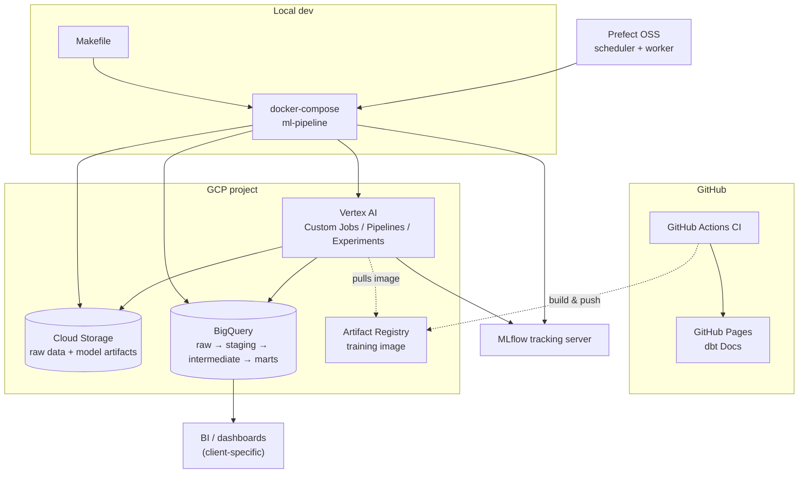
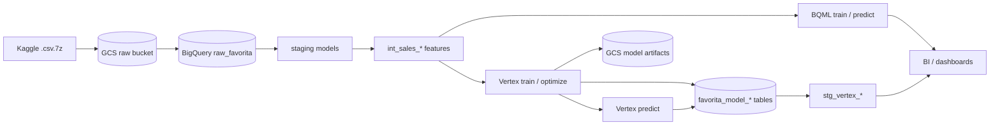



# Favorita sales forecasting

Reference pipeline for [Corporación Favorita](https://www.kaggle.com/competitions/favorita-grocery-sales-forecasting) grocery sales forecasting, built by [The Data Strategist](https://www.thedatastrategist.com). It demonstrates a production-style analytics engineering stack on **Google BigQuery** with optional **BigQuery ML** and **Vertex AI** training paths.

## Consulting package

This project is structured as a **productized consulting engagement** with three layers:

1. **[Reference architecture](reference_architecture.md)** — how modern GCP forecasting stacks are structured
2. **[Accelerators](accelerators.md)** — reusable dbt, Vertex, MLflow, Prefect, and platform assets
3. **[Delivery artifacts](delivery_artifacts.md)** — case study, benchmarks, dashboard blueprint, rollout playbook, IaC

Start here: **[Consulting package overview](consulting_package.md)**

Product-specific views: [dbt](dbt/consulting_package.md) · [Vertex AI](vertex/consulting_package.md) · [MLflow](mlflow/consulting_package.md) · [Prefect](prefect/consulting_package.md)

## Business question

How much will stores sell by day, store, and product (and at coarser grains), including promotion and calendar effects in Ecuador?

## Architecture

| Layer | Dataset / location | Role |
|-------|-------------------|------|
| **Raw** | `raw_favorita` | Competition CSVs loaded from GCS (train, test, stores, holidays, oil, transactions) |
| **Staging** | `DBT_DATASET` | Cleaned, typed, incremental models; date spine, holiday logic, and `stg_favorita_sales_fct` (train ∪ test at store-product-day) |
| **Intermediate** | `DBT_DATASET` | `int_sales_*` feature tables at company, store, store-product, and store–product-family grains |
| **Marts** | `DBT_DATASET` | BQML train / predict / evaluate / explain (tagged `bqml`); Vertex outputs staged via `stg_vertex_*` |

### System diagram

The systems involved and how they integrate (execution environments, GCP services, orchestration, tracking):

### Data flow diagram

How data itself moves through the pipeline, from raw source to consumption:

See [reference_architecture.md](reference_architecture.md) for deeper flow diagrams (operational sequence, dual ML path, security/environments, CI/CD).

## Model grains

- **Company-day** — `int_sales_daily` (default BQML training input)
- **Store-day** — `int_sales_store_daily` (default Vertex XGBoost / RF / ARIMA)
- **Store-product-day** — `int_sales_store_product_daily`
- **Store–product-family-day** — `int_sales_store_product_family_daily`

## How to run

1. Load raw data: `make load-favorita-bigquery`
2. Build features (excludes BQML): `make dbt-run`
3. **BQML path:** `make dbt-train` then `make dbt-predict`
4. **Vertex path:** `make vertex-train` / `make vertex-predict` (see `vertex/config/model_config.yaml`)
5. **Vertex staging in dbt:** `make dbt-vertex`

Generate this site locally: `make dbt-ui` (http://127.0.0.1:8080).

## Data quality notes

- **Holidays:** Pay attention to `transferred` on holiday events (see `raw_favorita_holiday_events` source docs). Staging expands holidays to stores in `stg_favorita_store_holiday_events`.
- **Oil prices:** Ecuador’s economy is oil-sensitive; `stg_favorita_oil` aligns prices to the project date spine.
- **Tests:** Staging and intermediate models have grain and `not_null` tests; run `make dbt-test` after `make dbt-run`.

## Exposures

Downstream **exposures** in this project document how transformed tables feed ML and operational use cases (company forecast, Vertex training, calendar dimensions, store master). Open the lineage graph and select an exposure to highlight upstream dependencies.


