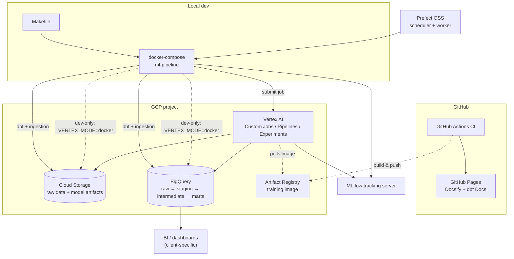
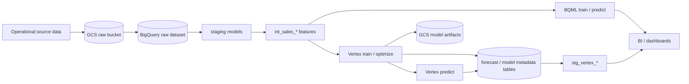



# GCP demand forecasting platform

Production-style demand forecasting platform for Google Cloud, built by [The Data Strategist](https://www.thedatastrategist.com). It demonstrates a reusable GCP pattern for governed dbt features, **BigQuery ML** baselines, **Vertex AI** custom models, experiment tracking, orchestration, and forecast operations.

To configure the reference implementation and generate a persisted canonical forecast, start with
[Generate your first forecast](first_forecast.md). Use this page for the architectural context
behind that walkthrough.

The platform is intentionally **GCP-first** and intentionally **dbt-adapted per project**. Each implementation maps its own operational data into forecast-ready dbt models, because demand features, source systems, covariates, and planning grains vary by business.

## Open-source forecasting platform on GCP

The platform documentation is organized into three layers:

1. **[Reference architecture](reference_architecture.md)** — how modern GCP forecasting stacks are structured
2. **[Accelerators](accelerators.md)** — reusable dbt, Vertex, MLflow, Prefect, and platform assets
3. **[Operating guides](delivery_artifacts.md)** — evaluation, dashboard, adoption, and infrastructure guidance

Start here: **[Open-source forecasting platform on GCP](platform_guide.md)**

Product-specific views: [dbt](dbt/component_guide.md) · [Vertex AI](vertex/component_guide.md) · [MLflow](mlflow/component_guide.md) · [Prefect](prefect/component_guide.md)

## Business question

Given a project's demand history, known-future covariates, business calendar, hierarchy, and planning grain, what forecast should be generated, evaluated, approved, and delivered for each forecast origin and horizon?

## Architecture

| Layer | Dataset / location | Role |
|-------|-------------------|------|
| **Raw** | configured raw dataset | Project source data loaded from GCS / BigQuery ingestion jobs |
| **Staging** | `DBT_DATASET` | Cleaned, typed, incremental models for the project's source data, entities, calendar, and covariates |
| **Intermediate** | `DBT_DATASET` | Project-owned `int_sales_*` or equivalent feature tables at the selected planning grains |
| **Marts** | `DBT_DATASET` | BQML train / predict / evaluate / explain (tagged `bqml`); Vertex outputs staged via `stg_vertex_*` |

### System diagram

The systems involved and how they integrate (execution environments, GCP services, orchestration, tracking):

`ml-pipeline` always talks to BigQuery/GCS directly for dbt and raw ingestion — that's not ML compute and has no Vertex equivalent. For **training / predict / optimize**, the direct-write arrows (dashed) are a **local-dev-only** path (`VERTEX_MODE=docker`, used by the manual Prefect deployments and `make vertex-train` etc.) for fast, free iteration. **Scheduled** deployments in `prefect.yaml` always use `VERTEX_MODE=vertex`, so production/scheduled ML compute only ever reaches BigQuery/GCS through Vertex AI Custom Jobs / PipelineJobs — the container just submits the job. See [reference_architecture.md](reference_architecture.md#dual-ml-path-same-features-different-tradeoffs) and [iac.md](iac.md) for the IAM split this implies.

### Data flow diagram

How data itself moves through the pipeline, from raw source to consumption:

See [reference_architecture.md](reference_architecture.md) for deeper flow diagrams (operational sequence, dual ML path, security/environments, CI/CD).

## Model grains

- **Aggregate-day** — default BQML-style executive rollup grain
- **Location-day** — default Vertex-style operational planning grain
- **Location-product-day** — item-level demand planning grain
- **Location-product-family-day** — category planning grain

The checked-in dbt project names these models with `int_sales_*` conventions. A new implementation should keep the platform contracts stable while adapting the dbt feature models to the business's own entities and covariates.

## How to run

The full validated sequence is documented in [Generate your first forecast](first_forecast.md).
At a high level:

1. Bootstrap GCP/GitHub and validate the forecast, feature, model, and backtest contracts.
2. Load raw data and build project-specific dbt features.
3. Apply the canonical forecast-output DDL.
4. Train and predict with the configured Vertex model.
5. Build the dbt consumption views and verify `forecast_runs` and `forecast_outputs`.
6. Backtest and promote before enabling scheduled champion-to-draft execution.

The scheduled pipeline currently ends at a validated visible draft. A separate gated manual flow
supports draft validation and idempotent auto-publication, but planner review and overrides,
automatic delivery, hierarchy-enabled acceptance, and full operational SLO coverage should be
evaluated against the [specification status table](specs/README.md) before production use.

For a controlled reset or recovery that preserves the raw dataset and reconstructs the derived dataset, use the [Clean Rebuild Runbook](clean_rebuild.md). Do not use dataset deletion for routine deployments or maintenance.

Generate this site locally: `make dbt-ui` (http://127.0.0.1:8080).

## Data quality notes

- **Known-future covariates:** Calendar, holiday, price, promotion, assortment, and event plans must be modeled as known in advance only when they would have been available at forecast origin.
- **Observed covariates:** Sales, transactions, inventory, and other observed facts must be lagged or cutoff-aware to avoid leakage.
- **Tests:** Staging and intermediate models have grain and `not_null` tests; run `make dbt-test` after `make dbt-run`.

## Exposures

Downstream **exposures** in this project document how transformed tables feed ML and operational use cases (company forecast, Vertex training, calendar dimensions, store master). Open the lineage graph and select an exposure to highlight upstream dependencies.


