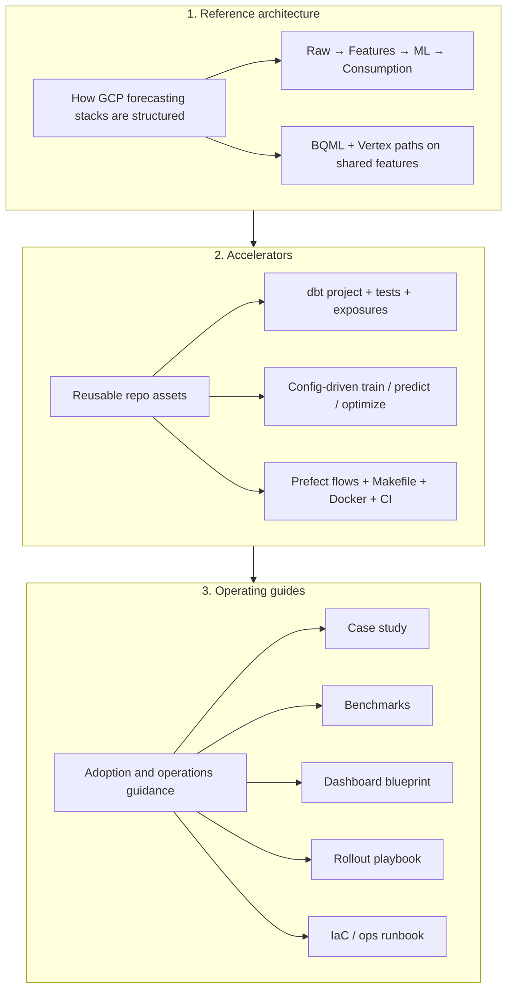



# Open-source forecasting platform on GCP

This repository is an **open-source forecasting platform on GCP**. It provides reusable
contracts, infrastructure, model execution, evaluation, orchestration, and forecast operations
while leaving business-specific source adaptation and demand semantics to each implementation.

It is designed for teams that want a reusable GCP foundation while retaining control of their own dbt feature engineering, business definitions, forecast grains, and planning workflow.

It is designed for three audiences:

| Audience | What to read first |
|----------|-------------------|
| **Executive / business** | [Case study](case_study.md) — problem, approach, outcomes |
| **Platform / data engineering** | [Reference architecture](reference_architecture.md) — layers, flows, GCP services |
| **Platform adopter** | [Accelerators](accelerators.md) + [Adoption guide](client_rollout.md) |

Product-specific views: [dbt](dbt/component_guide.md) · [Vertex AI](vertex/component_guide.md) · [MLflow](mlflow/component_guide.md) · [Prefect](prefect/component_guide.md)

---

## Platform documentation layers

### Layer 1 — Reference architecture

Documents **how** a production GCP forecasting platform is structured: ingestion, analytics engineering, dual ML paths (warehouse-native and custom Python), orchestration, experiment tracking, and consumption.

→ Full detail: [reference_architecture.md](reference_architecture.md)

### Layer 2 — Accelerators

Reusable code and configuration that shorten implementation time:

- dbt models (`staging` → `intermediate` → `marts`) with grain tests and lineage exposures
- Vertex registry + `model_config.yaml` for XGBoost, Random Forest, ARIMA, SARIMA
- Prefect deployments for daily dbt and weekly ML pipelines
- MLflow + Vertex Experiments on every job run
- Docker image, Makefile targets, GitHub Actions CI

→ Inventory: [accelerators.md](accelerators.md)

### Layer 3 — Operating guides

Guidance for evaluating, adopting, operating, and extending the platform:

| Artifact | Location | Status |
|----------|----------|--------|
| Case study | [case_study.md](case_study.md) | Available |
| Benchmarks | [benchmarks.md](benchmarks.md) | Template + query recipes |
| Dashboard blueprint | [delivery_artifacts.md](delivery_artifacts.md#dashboard-blueprint) | Blueprint (BI layer planned) |
| Adoption playbook | [client_rollout.md](client_rollout.md) | Available |
| IaC / GCP ops | [iac.md](iac.md) + `vertex/ops/README.md` | Runbook + Terraform modules available |
| Demand and eligibility | [demand_data_model.md](demand_data_model.md) | Live-accepted observed-sales proxy, immutable candidate decisions, exclusion reasons, pinned snapshots, population gates, and monitoring |
| Forecast monitoring | [monitoring_and_slos.md](monitoring_and_slos.md) | Live-accepted source, pipeline, publication-freshness, prediction-coverage, feature-completeness, realized-calibration, and target/feature-drift signals; configurable routing and opt-in Cloud Monitoring policy available |
| Forecast operations | [forecast_operations.md](forecast_operations.md) | Override, approval, revision, and rollback commands available |
| Forecast Value Added | [forecast_value_added.md](forecast_value_added.md) | Benchmark, planner-adjustment, and publication accuracy attribution |
| Integration contracts | [integration_contracts.md](integration_contracts.md) | Stable warehouse views, GCS batch export, delivery events, and a private live-accepted retrieval API |
| Hierarchical reconciliation | [hierarchical_reconciliation.md](hierarchical_reconciliation.md) | Configuration, validation, metrics, and fail-closed runbook available |

→ Index: [delivery_artifacts.md](delivery_artifacts.md)

---

## Platform boundaries

**What the platform provides:** governed feature and forecast contracts in BigQuery, BQML and
custom Vertex model paths, orchestrated refreshes, auditable predictions, and production-oriented
IAM and scheduling patterns.

**What adopters configure:** datasets and grains, model families, schedules, compute tier,
delivery destinations, and enterprise controls such as VPC-SC, WIF, and CMEK.

**What each implementation owns:** the dbt models that map raw operational data into
forecast-ready staging, feature, eligibility, hierarchy, and mart layers. This boundary is
intentional because demand signals vary by domain, source-system maturity, inventory visibility,
and planning process.

**Generalization workstream:** the current implementation still contains daily-period,
Favorita-resource, and fixed retail-identity assumptions. The proposed
[platform-generalization specification](specs/platform_generalization.md) introduces canonical
dataset contracts, configurable daily/weekly/monthly periods, centralized deployment resources,
and typed extension interfaces. Cross-domain proof through multiple reference implementations is
deferred to a later workstream.

**Proof points in this repo:**

- End-to-end lineage in dbt Docs (including exposures for ML consumers)
- Same feature tables feed BQML and Vertex
- Config-driven ML without fork-per-model scripts
- CI validates configs, compiles KFP pipelines, and runs unit tests without GCP
- Append-only source ingestion evidence with distinct static-demo and continuous freshness semantics

---

## Quick navigation

| Topic | Document |
|-------|----------|
| Architecture diagrams & data flows | [reference_architecture.md](reference_architecture.md) |
| Repo accelerators (files, commands) | [accelerators.md](accelerators.md) |
| Case study narrative | [case_study.md](case_study.md) |
| Model benchmarks | [benchmarks.md](benchmarks.md) |
| 4-week rollout | [client_rollout.md](client_rollout.md) |
| GCP IAM, scheduling, IaC | [iac.md](iac.md) |
| Roadmap / engineering specs | [specs/README.md](specs/README.md) |
| Platform generalization workstream | [specs/platform_generalization.md](specs/platform_generalization.md) |
| dbt-only view | [dbt/component_guide.md](dbt/component_guide.md) |
| Vertex-only view | [vertex/component_guide.md](vertex/component_guide.md) |
| MLflow-only view | [mlflow/component_guide.md](mlflow/component_guide.md) |
| Prefect-only view | [prefect/component_guide.md](prefect/component_guide.md) |


