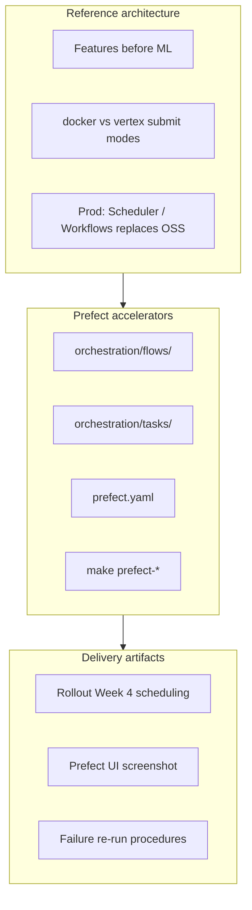
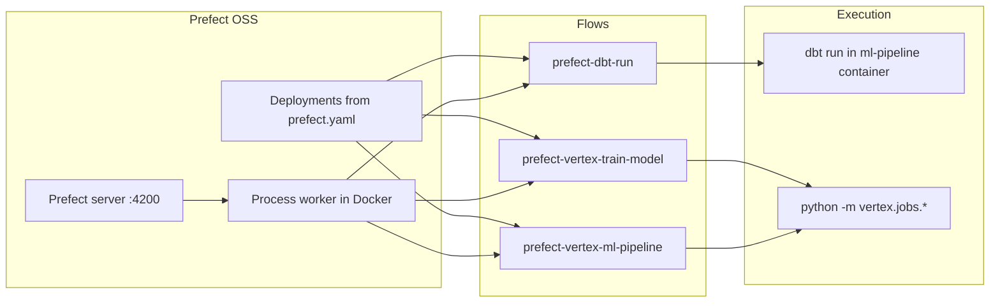



# Prefect consulting package — Favorita forecasting

**Prefect's role** in this engagement: **orchestrate** recurring dbt feature builds and Vertex ML workloads (train-only or full optimize → train → predict pipelines) with a local OSS demo path that maps cleanly to Cloud Scheduler / Workflows in production.

Parent overview: [consulting_package.md](../consulting_package.md)

---

## Prefect in the three-layer package



---

## Reference architecture (Prefect lens)



### Production mapping

| Demo (this repo) | Client production |
|------------------|-------------------|
| Prefect OSS + process worker | Prefect Cloud, Composer, or Cloud Workflows |
| `make prefect-run-dbt` | Cloud Scheduler → dbt Cloud / Cloud Run |
| `vertex_mode=docker` | `vertex_mode=vertex` + PipelineJob |
| Cron in `prefect.yaml` | Client timezone + SLA windows |

---

## Accelerators (Prefect-specific)

| Asset | Path |
|-------|------|
| Flows | `orchestration/flows/dbt.py`, `vertex.py`, `vertex_pipeline.py` |
| Tasks | `orchestration/tasks/dbt.py`, `vertex.py` |
| Utils | `orchestration/utils/` — config resolution, repo root |
| Deployments | `prefect.yaml` (repo root) |
| README | `orchestration/README.md` |

### Deployments

| Deployment | Schedule (UTC) | Flow |
|------------|----------------|------|
| `prefect-dbt-run-manual` | On demand | dbt feature refresh |
| `prefect-dbt-run-scheduled` | Daily 06:00 | dbt feature refresh |
| `prefect-vertex-train-model-manual` | On demand | Single train config |
| `prefect-vertex-train-model-schedule` | Daily 07:00 | Training |
| `prefect-vertex-ml-pipeline-manual` | On demand | optimize → train → predict |
| `prefect-vertex-ml-pipeline-scheduled` | Sun 08:00 | XGBoost full pipeline |

### Key commands

```bash
make prefect-server              # UI http://127.0.0.1:4200
make prefect-work-pool-create    # once
make prefect-deploy              # register deployments
make prefect-worker              # execute runs

make prefect-run-dbt
make prefect-run-vertex-train
make prefect-run-vertex-pipeline VERTEX_PIPELINE=favorita_xgboost

# Dev: no server required
make prefect-flow-dbt
make prefect-flow-vertex-pipeline SKIP_OPTIMIZE=1
```

### Flow parameters (Vertex)

| Parameter | Default | Description |
|-----------|---------|-------------|
| `config_name` | `favorita_xgboost_train` | Train config from YAML |
| `train_all` | `false` | Train all `include_in_run` configs |
| `vertex_mode` | `docker` | `docker` or `vertex` (Custom Job / PipelineJob) |
| `sync` | `false` | Wait for Vertex job completion |
| `pipeline_name` | `favorita_xgboost` | KFP pipeline key |
| `skip_optimize` / `skip_predict` | `false` | Pipeline step toggles |

---

## Design: no nested Docker

Prefect **worker runs inside `ml-pipeline`**. Tasks call `dbt` and `python -m vertex.jobs.*` directly — same as Makefile targets, without spawning `docker compose` from within the container.

| Makefile (host) | Prefect task (in container) |
|-----------------|----------------------------|
| `make dbt-run` | `dbt run --project-dir dbt ...` |
| `make vertex-run-docker` | `python -m vertex.jobs.run ...` |
| `make vertex-pipeline-submit` | `python -m vertex.jobs.submit_pipeline ...` |

---

## Delivery artifacts (Prefect-specific)

| Artifact | Prefect contribution |
|----------|---------------------|
| **Case study** | Scheduled refresh without managed Composer cost for demos |
| **Rollout** | Week 4: deploy schedules; document prod replacement |
| **IaC** | Map cron to Cloud Scheduler ([iac.md](../iac.md)) |
| **Demo** | Prefect UI showing dbt → pipeline dependency chain |

### Recommended orchestration order

1. **dbt run** — refresh `int_sales_*`
2. **Vertex pipeline** — optimize (optional) → train → predict
3. **dbt-vertex** — refresh `stg_vertex_*` (add as flow task or manual step)

---

## Environment variables

From `env.example`:

```bash
# PREFECT_API_URL=http://127.0.0.1:4200/api
# PREFECT_DEFAULT_VERTEX_MODE=docker   # or vertex
```

Makefile defaults worker API to `http://host.docker.internal:4200/api`.

---

## Client customization (Prefect)

1. Edit cron expressions in `prefect.yaml` for client timezone
2. Set `PREFECT_DEFAULT_VERTEX_MODE=vertex` for GCP execution
3. Add flow task for `dbt-vertex` after predict step
4. Migrate to Prefect Cloud or Workflows for enterprise SLA / RBAC

---

## Related documents

- [orchestration/README.md](../../../orchestration/README.md)
- [Client rollout](../client_rollout.md) — Week 4
- [IaC — Scheduling](../iac.md#scheduling-production)
- Other products: [dbt](../dbt/consulting_package.md) · [Vertex](../vertex/consulting_package.md) · [MLflow](../mlflow/consulting_package.md)


