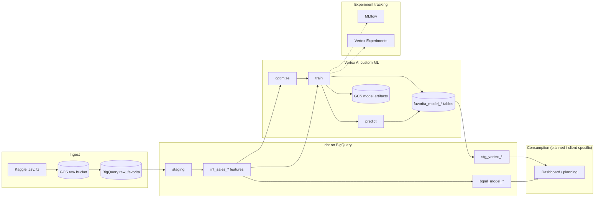
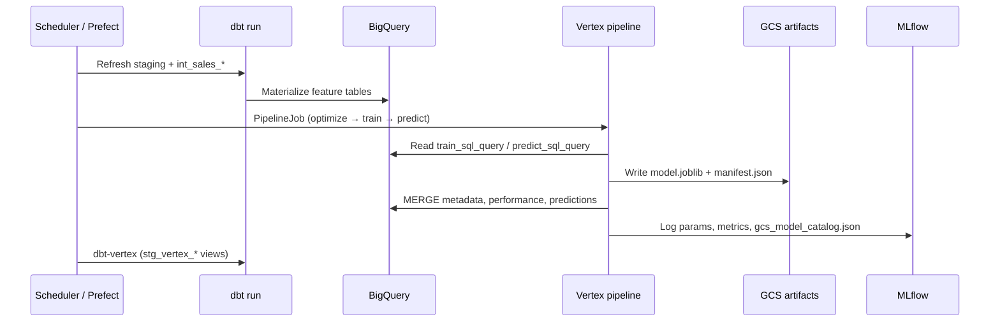
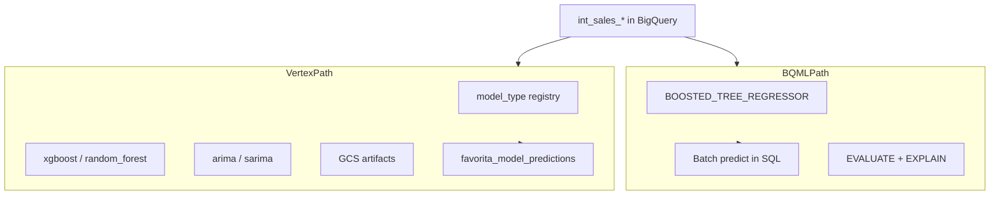
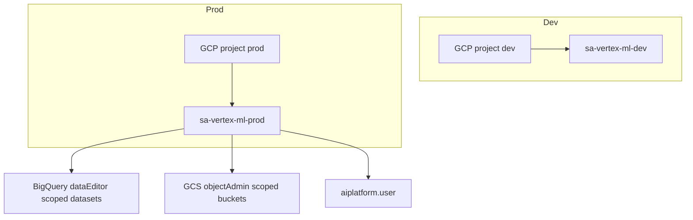
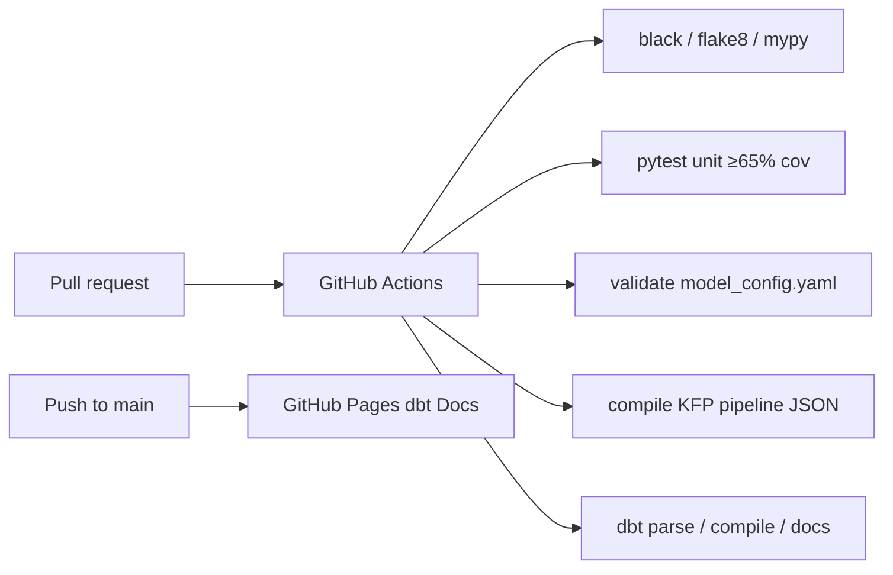



# Reference architecture — GCP demand forecasting

Modern retail and CPG forecasting on Google Cloud typically separates **feature engineering in the warehouse**, **model training** (warehouse-native or custom), **orchestration**, and **consumption** (BI, planning systems, or APIs). This project implements that pattern on BigQuery + Vertex AI.

---

## Logical layers

| Layer | GCP services | This repo |
|-------|--------------|-----------|
| **Ingestion** | GCS, BigQuery load jobs | `scripts/load_favorita_to_bigquery.py`, `raw_favorita` |
| **Analytics engineering** | BigQuery, dbt | `dbt/models/staging`, `intermediate`, `marts` |
| **ML — warehouse** | BigQuery ML | `dbt/models/marts/ml_models/bqml_model_*` |
| **ML — custom** | Vertex Custom Jobs, PipelineJobs, GCS | `vertex/` + `model_config.yaml` |
| **Orchestration** | Prefect OSS (local) → Cloud Scheduler / Workflows (prod) | `orchestration/`, `prefect.yaml` |
| **Experiment tracking** | MLflow, Vertex AI Experiments | `vertex/utils/experiment_tracking.py` |
| **Metadata & predictions** | BigQuery tables | `vertex/ddl/vertex_bq_tables.sql` |
| **Consumption** | Looker, Looker Studio, Sheets, APIs | dbt exposures + `stg_vertex_*` (BI layer blueprint) |

---

## End-to-end data flow

---

## Daily / weekly operational flow

Recommended schedule (implemented in `prefect.yaml`):

1. **06:00 UTC** — dbt feature refresh (`prefect-dbt-run-scheduled`)
2. **07:00 UTC** — optional train-only Custom Job
3. **Sunday 08:00 UTC** — full XGBoost pipeline (`prefect-vertex-ml-pipeline-scheduled`)

Production clients typically replace Prefect OSS with **Cloud Scheduler → Cloud Run/Workflows** calling the same Python entrypoints (`vertex/ops/README.md`).

---

## Dual ML path (same features, different tradeoffs)

| Dimension | BigQuery ML | Vertex custom (this repo) |
|-----------|-------------|---------------------------|
| **Best for** | Fast baseline, SQL-only teams, low ops | Custom algorithms, Optuna tuning, multi-step pipelines |
| **Training** | `CREATE MODEL` via dbt macros | Custom Jobs / KFP PipelineJobs |
| **Artifacts** | BQ model registry | GCS joblib + manifest (MLflow catalog pointer) |
| **Predictions** | `ML.PREDICT` in dbt | Python runners → unified BQ fact table |
| **Feature input** | `int_sales_daily` (default) | `int_sales_store_daily` (default XGBoost config) |
| **Experiment tracking** | BQML evaluate tables | MLflow + Vertex Experiments + BQ performance |

---

## Feature grains

Forecasting granularity is a core architecture decision. This repo materializes four intermediate tables:

| Grain | Model | Primary consumers |
|-------|-------|-------------------|
| Company-day | `int_sales_daily` | BQML default, executive rollup |
| Store-day | `int_sales_store_daily` | Vertex XGBoost / RF / ARIMA default |
| Store-product-day | `int_sales_store_product_daily` | Item-level demand |
| Store–product-family-day | `int_sales_store_product_family_daily` | Category planning |

All grains share staging foundations: date spine, Ecuador holidays (including `transferred`), oil prices, promotions, and store attributes.

---

## Security & environments (production pattern)

See [iac.md](iac.md) and `vertex/ops/README.md` for IAM roles, chargeback labels (`GCP_CLIENT_LABEL`, `GCP_ENVIRONMENT`), and the security checklist.

---

## CI/CD architecture

Warehouse-backed runs (`dbt run`, `dbt test`, Vertex submit) execute in the client GCP project after credentials are configured — not in CI.

---

## Related documents

- [Accelerators](accelerators.md) — what is implemented in this repo
- [Case study](case_study.md) — business framing
- Product views: [dbt](dbt/consulting_package.md) · [Vertex](vertex/consulting_package.md) · [MLflow](mlflow/consulting_package.md) · [Prefect](prefect/consulting_package.md)


