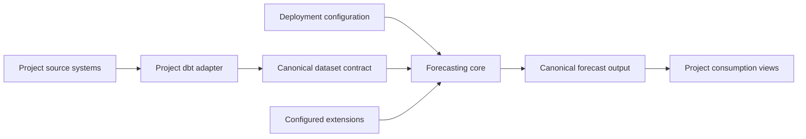



# SPEC: General-purpose demand forecasting platform

**Status:** Proposed
**Roadmap reference:** [Specs overview](README.md) — separate platform-generalization workstream

---

## Summary

The repository is a reusable GCP accelerator for daily, retail-style demand forecasting, but
several runtime contracts still encode daily periods, Favorita identifiers, retail entities, and
internal extension conventions. Completing the existing forecasting and operational roadmap does
not remove those constraints by itself.

This separate workstream makes the platform reusable across daily, weekly, and monthly batch
demand-forecasting implementations without requiring changes to core Python or DDL for each
project. It covers four coordinated capabilities:

1. a canonical, domain-neutral dataset interface;
2. parameterized cloud resources and entity identifiers;
3. configurable forecast frequency and horizon units; and
4. documented extension interfaces for models, datasets, metrics, routing, and publishers.

Validation against multiple materially different implementations is intentionally deferred to a
later workstream. Until that validation exists, the result should be described as a generalized
platform contract rather than proven domain portability.

## Goals

- Let a new implementation integrate primarily through dbt models and YAML configuration.
- Support daily, weekly, and monthly forecast periods with consistent horizon semantics.
- Remove Favorita, store, product, and sales-specific assumptions from core runtime paths.
- Move a deployment between GCP projects and environments without editing Python, SQL, or
  Terraform source.
- Define stable, typed extension points with reusable contract tests.
- Preserve the current Favorita implementation through compatibility views and migration tests.

## Non-goals

- Multi-cloud or warehouse-neutral execution; GCP, BigQuery, GCS, and Vertex remain the target.
- Real-time or streaming forecast serving.
- Deep-learning, causal-forecasting, or business-optimization capabilities.
- A marketplace, remote plugin service, or independent package-distribution system.
- Proving portability with multiple reference implementations; that is a later workstream.
- Replacing project-owned dbt feature engineering with universal source connectors.

## Architectural decisions

### Stable platform boundary

Core forecasting code consumes canonical platform relations and typed domain objects. A project
adapter maps operational data into those relations. Business-specific convenience fields remain
in adapter or consumption models, not canonical output tables.



### Period-count horizons

`horizon` represents a count of configured forecast periods rather than an implicit count of
days. For a weekly contract, horizon 2 means two weekly periods. Target timestamps are calculated
by one temporal abstraction that owns period alignment and calendar arithmetic.

### Explicit extension registration

The first release uses validated import paths in configuration. Python package entry-point
discovery may be added later if extensions are distributed independently.

## Work package 1: canonical dataset interface

This package is implemented first because resource, temporal, and extension contracts depend on
a stable domain model.

### Canonical relations

Define dbt contracts for these logical relations:

| Relation | Required responsibility |
|----------|-------------------------|
| `forecast_series` | Stable series identity, dimensions, lifecycle, and hierarchy membership |
| `forecast_observations` | Historical target values at one row per series and period |
| `forecast_features` | Point-in-time-correct training and scoring features |
| `forecast_eligibility` | Forecastable series-period rows and explicit exclusion reasons |
| `forecast_hierarchy_nodes` | Versioned hierarchy nodes |
| `forecast_hierarchy_edges` | Versioned parent/child relationships and optional allocation weights |

The initial physical implementation may use one wide feature relation, provided it satisfies the
logical contracts.

### Minimum canonical fields

| Field | Meaning |
|-------|---------|
| `series_key` | Stable opaque identifier for one forecast series |
| `period_start` | Timestamp or date identifying the observation period |
| `target_value` | Historical demand target |
| `target_observed` | Whether the actual is available |
| `is_eligible` | Whether the series-period may be forecast |
| `eligibility_reason` | Inclusion or exclusion reason |
| `data_cutoff` | Latest source information included at forecast origin |
| `entity_key_json` | Canonical structured dimension identity |

Model features remain columns declared by the feature-availability registry. Frequently queried
dimensions may be exposed as physical columns, but core identity must not depend on names such as
`store_nbr`, `store_id`, or `product_id`.

### Model configuration

Model inputs reference the canonical relation and column roles:

```yaml
dataset:
  relation: forecast_features_store_item
  series_key_column: series_key
  time_column: period_start
  target_column: target_value
  dimension_columns: [location_id, item_id]
  eligibility_column: is_eligible
```

### Migration

1. Add canonical views over the current Favorita intermediate models.
2. Add uniqueness, nullability, type, point-in-time, eligibility, and hierarchy tests.
3. Migrate training, prediction, backtesting, publication, and reconciliation consumers.
4. Move Favorita-specific output columns into downstream consumption views.
5. Retain compatibility aliases until the migration policy permits their removal.

### Acceptance criteria

- Core Python contains no Favorita, store, product, or `sales_store_*` identifiers.
- One series identity is used consistently across training, scoring, backtesting, and publication.
- A new project integrates by implementing documented dbt contracts and configuration.
- Favorita forecast results remain behaviorally equivalent through the canonical views.

## Work package 2: deployment and identifier parameterization

Create one typed deployment manifest as the source of truth for environment-specific resources:

```yaml
deployment:
  platform_name: demand_forecasting
  environment: dev
  cloud:
    project_id: ${GCP_PROJECT_ID}
    region: ${GCP_REGION}
  bigquery:
    raw_dataset: ${BQ_RAW_DATASET}
    platform_dataset: ${BQ_PLATFORM_DATASET}
    location: ${BQ_LOCATION}
  storage:
    model_bucket: ${MODEL_BUCKET}
    pipeline_bucket: ${PIPELINE_BUCKET}
```

### Required changes

- Resolve fully qualified tables and GCS paths through a typed resource catalog.
- Parameterize model configuration, orchestration defaults, CLI defaults, dbt profiles and vars,
  Prefect deployments, Terraform, Make targets, smoke scripts, and acceptance scripts.
- Render infrastructure identifiers through validated templates; continue to pass query values as
  BigQuery parameters.
- Describe entity dimensions in the forecast contract rather than deployment configuration.
- Treat `series_key` and `entity_key_json` as canonical; expose retail columns only in project
  views.
- Add a `validate-deployment` command that detects missing settings, unresolved placeholders,
  invalid identifiers, cross-environment targets, and incompatible model/contract dimensions.

### Acceptance criteria

- A deployment moves between GCP projects through configuration alone.
- Generated DDL and submitted jobs target only the configured resources.
- No hard-coded `tds-favorita`, `raw_favorita`, or Favorita bucket value remains outside examples,
  fixtures, documentation, and the Favorita adapter.
- Configuration validation completes before a cloud mutation or job submission.

## Work package 3: frequency and horizon abstraction

Expand the forecast contract with explicit period semantics:

```yaml
forecast:
  frequency: week
  interval: 1
  horizon_unit: period
  horizons: [1, 2, 4, 8, 13]
  training_window_periods: 104
  calendar:
    type: iso_week
    timezone: America/New_York
    week_starts_on: monday
```

### Temporal service

Add one temporal configuration/service responsible for:

- supported frequencies and pandas aliases;
- BigQuery interval rendering;
- origin-to-target calculations;
- period alignment and calendar boundaries;
- training and validation purge windows;
- seasonal periods and baseline lookups; and
- backfill increments.

All runtime paths must use this service rather than `timedelta(days=...)`, `unit="D"`, or
`freq="D"`. Initial support covers daily, weekly, and monthly periods. Business calendars and
irregular frequencies may follow later.

### Persistence and SQL

- Prefer a canonical `target_timestamp`; preserve `target_date` only as a compatibility field if
  required.
- Replace “training window days” and “purge days” with period-based equivalents.
- Replace day-specific dbt tests with frequency-aware macros or validation against the canonical
  target timestamp.
- Update schema descriptions so `horizon` means forecast periods, not days.

### Model-family changes

- ARIMA/SARIMA use configured frequency and seasonal period.
- Prophet constructs its future dataframe at the configured frequency.
- Tree and direct multi-horizon models use generic target/horizon mappings rather than `_n1d` and
  `_n7d` conventions.
- Seasonal baselines declare period lags instead of assuming seven days.
- Backtesting, calibration, reconciliation, and publication preserve the same temporal identity.

### Acceptance criteria

- Daily, weekly, and monthly contract suites pass through the complete forecast pipeline.
- Core runtime code has no daily arithmetic outside the temporal implementation.
- Month ends, leap years, week boundaries, and daylight-saving transitions are tested.
- Backtests, purges, seasonal baselines, backfills, and target timestamps use forecast periods.

## Work package 4: documented extension interfaces

Replace loosely shaped runner dictionaries with typed, versioned request and result contracts.
Provide built-in implementations and shared contract tests for each interface.

### Model provider

```python
class ModelProvider(Protocol):
    name: str
    supported_steps: set[str]

    def validate(self, config: ModelConfig) -> None: ...
    def train(self, context: TrainingContext) -> ModelArtifact: ...
    def predict(self, context: PredictionContext) -> PredictionBatch: ...
    def optimize(self, context: OptimizationContext) -> OptimizationResult: ...
```

Wrap XGBoost, random forest, ARIMA, SARIMA, and Prophet as built-in providers.

### Additional interfaces

| Interface | Responsibility |
|-----------|----------------|
| `DatasetAdapter` | Validate and resolve training, scoring, and hierarchy sources |
| `MetricProvider` | Declare required columns, aggregation, direction, and metric results |
| `RoutingStrategy` | Select a forecast or fallback with reason and confidence lineage |
| `ForecastPublisher` | Validate and deliver a canonical forecast batch with a receipt |

Initial built-ins include the BigQuery/dbt dataset adapter, existing accuracy metrics and routing
strategies, and the canonical BigQuery publisher.

### Discovery and stability

Configured extensions use validated import paths:

```yaml
extensions:
  models:
    - type: lightgbm
      provider: client_forecasting.models:LightGBMProvider
```

Each interface must provide:

- typed request and result models;
- an API version and capability declaration;
- a documented error taxonomy;
- a reference implementation and minimal external example;
- a contract-test suite for extension authors; and
- compatibility and deprecation rules.

### Acceptance criteria

- A toy model provider loads outside `vertex/models` without changing the central registry.
- A custom metric, routing strategy, and publisher load through configuration.
- Invalid or incompatible extensions fail startup validation.
- Built-in and external implementations run against the same contract tests.
- Extension API version and capabilities are persisted with forecast-run lineage.

## Delivery sequence

| Phase | Scope | Exit condition |
|-------|-------|----------------|
| A. Platform contracts | ADRs, typed domain objects, canonical dbt views | Favorita runs through canonical contracts unchanged |
| B. Domain/resource removal | Identity migration, resource catalog, rendered DDL | Core paths contain no Favorita or fixed retail identity assumptions |
| C. Temporal abstraction | Period service plus model, SQL, and orchestration migration | Daily, weekly, and monthly suites pass |
| D. Extension API | Typed providers, discovery, docs, and contract tests | External examples load without core changes |

Only one phase should change the authoritative contract shape at a time. Compatibility views and
import shims remain until the next phase has regression evidence.

## Cross-workstream definition of done

- Canonical schemas contain no fixed retail entity columns.
- Daily, weekly, and monthly end-to-end contract suites pass.
- GCP project, dataset, table, bucket, pipeline, and entity identifiers are configurable.
- A deployment can be reproduced in another environment without source edits.
- A sample external model and publisher install without modifying core platform modules.
- Existing Favorita forecasts remain behaviorally equivalent.
- Configuration and extensions validate before cloud resources are mutated.
- Migration, extension-authoring, compatibility, and deprecation documentation is published.

## Deferred portability validation

A later workstream should test these contracts against at least three materially different
implementations, such as daily retail item demand, weekly B2B demand, and hourly operational
volume. Hourly validation may require expanding the initial temporal scope. Successful validation
means each implementation is added primarily through dbt models, configuration, and documented
extensions—not a fork of core Python or DDL.

## Related documents

- [Reference architecture](../reference_architecture.md)
- [Open-source product readiness](open_source_product_readiness.md)
- [Forecast contract and canonical output](forecast_contract_and_output.md)
- [Point-in-time feature availability](point_in_time_feature_availability.md)
- [Forecasting methods](forecasting_methods.md)
- [Integration contracts](integration_contracts.md)


