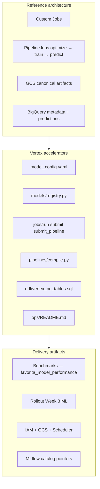
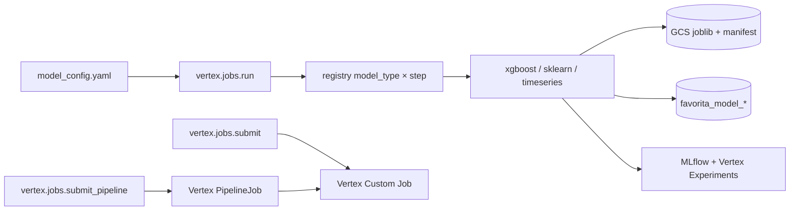



# Vertex AI consulting package — Favorita forecasting

**Vertex AI's role** in this engagement: run **config-driven custom ML** (train, predict, optimize) and **KFP pipelines** on BigQuery features, with GCS artifacts, unified prediction tables, and production IAM/scheduling patterns.

Parent overview: [consulting_package.md](../consulting_package.md)

---

## Vertex in the three-layer package



---

## Reference architecture (Vertex lens)



### Supported model types

| `model_type` | Module | Use case |
|--------------|--------|----------|
| `xgboost` | `models/xgboost/` | Tabular store-day forecasting |
| `random_forest` | `models/sklearn/` | Non-linear baseline, feature importance |
| `arima` | `models/timeseries/` | Per-entity univariate series |
| `sarima` | `models/timeseries/` | Seasonal patterns |

### Pipelines (KFP)

| Pipeline | Steps |
|----------|-------|
| `favorita_xgboost` | optimize → train → predict |
| `favorita_random_forest` | optimize → train → predict |
| `favorita_arima` | train → predict |

---

## Accelerators (Vertex-specific)

| Asset | Path |
|-------|------|
| Config | `vertex/config/model_config.yaml` |
| Loader / validate | `vertex/config/load_config.py`, `validate_all` |
| Entrypoints | `vertex/jobs/run.py`, `submit.py`, `submit_pipeline.py`, `run_batch.py` |
| Registry | `vertex/models/registry.py` |
| Predictions schema | `vertex/utils/predictions.py` |
| Experiment tracking | `vertex/utils/experiment_tracking.py` |
| MLflow catalog | `vertex/utils/mlflow_catalog.py` |
| BQ DDL | `vertex/ddl/vertex_bq_tables.sql` |
| Ops runbook | `vertex/ops/README.md` |
| Detailed README | `vertex/README.md` |

### Key commands

```bash
make vertex-train                    # Docker (default)
make vertex-predict
make vertex-optimize
make vertex-train VERTEX_MODE=vertex # Custom Job submit
make vertex-pipeline-compile
make vertex-pipeline-submit SYNC=1
make vertex-bq-ddl
make vertex-validate-configs
```

### Output tables

| Table | Contents |
|-------|----------|
| `favorita_model_metadata` | Training lineage, artifact URIs |
| `favorita_model_performance` | Holdout metrics (JSON) |
| `favorita_model_predictions` | Unified prediction fact |
| `favorita_model_optimize` | Optuna trials |
| `favorita_vertex_job_runs` | Orchestration audit |

dbt staging: `stg_vertex_model_predictions`, `stg_vertex_model_metadata`, `stg_vertex_job_runs` (`make dbt-vertex`).

---

## Delivery artifacts (Vertex-specific)

| Artifact | Vertex contribution |
|----------|----------------------|
| **Case study** | Dual path vs BQML; config-driven ML |
| **Benchmarks** | Query `favorita_model_performance`; compare model types |
| **Dashboard** | `stg_vertex_model_predictions` as primary fact |
| **Rollout** | Week 3: train/predict; Week 4: pipeline + Scheduler |
| **IaC** | `vertex/ops/README.md` — SA, buckets, labels, monitoring |

### Consulting pitch points

- **One YAML config** per model family — no script sprawl per client
- **Optimize → train** merges best params from GCS automatically
- **Same prediction schema** across XGBoost, RF, ARIMA, SARIMA
- **Docker = Vertex** — identical code path locally and in Custom Jobs
- **CI compiles KFP** without GCP credentials

---

## Production checklist

From `vertex/ops/README.md`:

- [ ] `VERTEX_PIPELINE_SERVICE_ACCOUNT` with least-privilege roles
- [ ] `VERTEX_AI_STAGING_BUCKET`, `VERTEX_AI_PIPELINE_ROOT`, `VERTEX_TRAINING_IMAGE`
- [ ] Chargeback labels: `GCP_CLIENT_LABEL`, `GCP_ENVIRONMENT`
- [ ] Cloud Scheduler → dbt then pipeline
- [ ] Monitor `favorita_vertex_job_runs` for `FAILED`

→ Full detail: [iac.md](../iac.md)

---

## Client customization (Vertex)

1. Point `train_sql_query` / `predict_sql_query` at client `int_sales_*`
2. Set `gcs_model_path`, output tables in `defaults`
3. Tune `machine_type`, `trial_count`, `train_days` in YAML
4. Add model family: new module + registry + three config blocks
5. Enable `mlflow.register_model` for Model Registry pointers

---

## Related documents

- [vertex/README.md](../../../vertex/README.md) — operational detail
- [Benchmarks](../benchmarks.md)
- [Reference architecture](../reference_architecture.md)
- Other products: [dbt](../dbt/consulting_package.md) · [MLflow](../mlflow/consulting_package.md) · [Prefect](../prefect/consulting_package.md)


